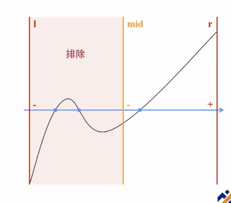
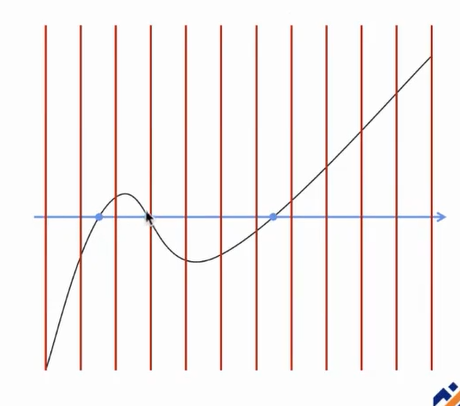
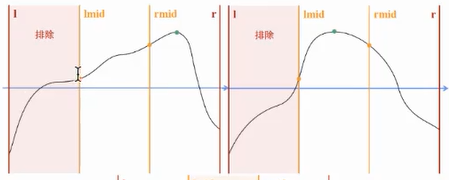
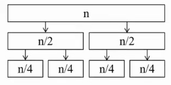

# 基础算法

- [基础算法](#基础算法)
  - [二分](#二分)
    - [二分的应用](#二分的应用)
      - [二分答案](#二分答案)
      - [实数二分](#实数二分)
        - [二分寻找函数零点](#二分寻找函数零点)
        - [二分0/1分数规划](#二分01分数规划)
        - [二分最小比值生成树](#二分最小比值生成树)
      - [二分延伸-实数三分](#二分延伸-实数三分)
        - [三分求连续函数的极值点](#三分求连续函数的极值点)
    - [三分优化](#三分优化)
    - [二分答案代码](#二分答案代码)
    - [实数二分代码](#实数二分代码)
    - [实数三分代码](#实数三分代码)
    - [二分三分例题](#二分三分例题)
      - [CF1355E Restorer Distance](#cf1355e-restorer-distance)
        - [CF1355E题解](#cf1355e题解)
        - [CF1355E参考代码](#cf1355e参考代码)
  - [分治](#分治)
    - [分治概括](#分治概括)
    - [分治应用](#分治应用)
      - [分治求逆序对](#分治求逆序对)
    - [分治例题](#分治例题)
      - [CF436D Pudding Monsters](#cf436d-pudding-monsters)
        - [CF436D题解](#cf436d题解)
  - [搜索进阶](#搜索进阶)
  - [搜索](#搜索)
    - [带剪枝的搜索](#带剪枝的搜索)
    - [启发式搜索](#启发式搜索)
    - [迭代加深搜索](#迭代加深搜索)
  - [倍增](#倍增)
    - [RMQ与ST表](#rmq与st表)
      - [RMQ与ST表应用](#rmq与st表应用)
        - [ST表求区间最大值](#st表求区间最大值)
      - [ST表的优劣](#st表的优劣)
    - [倍增例题](#倍增例题)
      - [P2048 NOI2010 超级钢琴](#p2048-noi2010-超级钢琴)
        - [P2048暴力代码](#p2048暴力代码)
        - [P2048题解](#p2048题解)
      - [例题2](#例题2)
        - [例题2题解](#例题2题解)
      - [P1084 疫情控制](#p1084-疫情控制)
        - [P1084题解](#p1084题解)
      - [P3295 萌萌哒](#p3295-萌萌哒)
        - [P3295朴素做法](#p3295朴素做法)
        - [P3295正解](#p3295正解)
  - [双指针](#双指针)
    - [双指针例题](#双指针例题)
      - [双指针例题1](#双指针例题1)
        - [双指针例题1题解](#双指针例题1题解)
        - [双指针例题1代码](#双指针例题1代码)
      - [双指针例题2](#双指针例题2)
        - [双指针例题2题解](#双指针例题2题解)
        - [双指针例题2代码](#双指针例题2代码)
      - [P1381 单词背诵](#p1381-单词背诵)
        - [P1381题解](#p1381题解)
        - [P1381代码](#p1381代码)
  - [折半搜索](#折半搜索)
  - [哈希，KMP](#哈希kmp)
  - [贪心](#贪心)
  - [构造转换模拟](#构造转换模拟)
    - [CF1916D Mathematical Problem](#cf1916d-mathematical-problem)
      - [CF1916D题解](#cf1916d题解)
      - [CF1916D参考代码](#cf1916d参考代码)
    - [CF1912E Evaluate It and Back Again](#cf1912e-evaluate-it-and-back-again)
      - [CF1912E题解](#cf1912e题解)
      - [CF1912E参考代码](#cf1912e参考代码)
    - [CF739A Alyona and mex](#cf739a-alyona-and-mex)
      - [CF739A题解](#cf739a题解)
      - [CF739A代码](#cf739a代码)
    - [CF1495C Garden of the Sun](#cf1495c-garden-of-the-sun)
      - [CF1495C题解](#cf1495c题解)
      - [CF1495C代码](#cf1495c代码)

## 二分

### 二分的应用

#### 二分答案

[代码](#二分答案代码)

#### 实数二分

[代码](#实数二分代码)

##### 二分寻找函数零点



单个：一次实数二分



多个：分割成段，多次二分

##### 二分0/1分数规划

给定等长数列 $a_i$, $b_i$, 求同样等长的数列 $w_i (w_i \in{0,1})$ , 最大化（或最小化） $\frac{\sum_i w_ia_i}{\sum_i w_ib_i}$。

考虑二分 $\frac{\sum_i w_ia_i}{\sum_i w_ib_i}$ 的最大值，在每一次二分中，相当于是验证 $\max{\frac{\sum_i w_ia_i}{\sum_i w_ib_i} \ge mid}$ 是否成立。

经过化简，每次二分的 $check$ 则变为了判断是否存在一组 $w_i$ 使 $\sum_iw_i(a_i-mid\times{b_i})\ge0$

##### 二分最小比值生成树

在一张无向连通图中，边具有 $a_i,b_i$ 两个权值，最小比值生成树是使 $\frac{\sum{a[i]}} {\sum{b[i]}}$ 最小的生成树

考虑用 $w_i (w_i \in{0, 1})$ 表示每条边是否选入树中，则该问题可转换为[01 分数规划问题](#二分01分数规划)

所以，我们令树上每一条边的边权为 $c_i(c_i = a_i - mid \times{b_i})$，然后便可转换为朴素最小生成树问题

#### 二分延伸-实数三分

##### 三分求连续函数的极值点

要求：单峰或单谷函数，峰的两侧必须是单调增或单调减

若不满足：切片后多次三分

过程：以单峰函数为例，设当前范围为 $[l, r]$，则取其三等分点 $lmid, rmid$，判断 $f(lmid)$ 与 $f(rmid)$ 的大小关系。

若 $f(rmid) > f(lmid)$ 则可以排除 $[l, lmid]$ 部分。

特别地，若 $f(rmid) = f(lmid)$，缩小范围可以直接缩减到 $[lmid, rmid]$ 范围（但是为了代码简洁，一般直接分到大于或小于部分，反正对时间复杂度影响不大:D）。



[代码](#实数三分代码)

### 三分优化

在二分与三分中，每次均取的是等分点，而实际上，不取等分点也可以进行二分或三分。

在二分中，假设每次取偏左的点，则如果搜索值在左边，就可大大缩减搜索量。但是如果搜索值在右边，则每次排除的区间就大大减少了。所以在二分中，一般取最中间的点。

而在三分中，如果让 $lmid$ 与 $rmid$ 尽量靠近，比如取 $lmid = \frac{50l + 49r}{99}, rmid = \frac{49l + 50r}{99}$，就可以将时间复杂度从 $O(log_{\frac{3}{2}})$ 优化到 $O(log_{\frac{99}{49}})$。

理论上，在[实数三分](#二分延伸-实数三分)中， $lmid, rmid$ 可以无限接近，但是要注意精度。

### 二分答案代码

```cpp
// 二分答案
int l = 0, r = n;
while (l <= r)
{
    int mid = l + r >> 1;
    if (check(mid))
        l = mid + 1;
    else
        r = mid - 1;
}
return l;
```

### 实数二分代码

```cpp
// 实数二分
double l = 0, r = n;
while (r - l > eps)
{
    double mid = (l + r) / 2;
    if (check(mid))
        l = mid;
    else
        r = mid;
}
```

### 实数三分代码

```cpp
double l = L, r = R;
for (int i = 0; i < 100; ++i)
{
    double lmid = l + (r - l) / 3, rmid = r - (r - l) / 3;
    if (f(lmid) < f(rmid))
        l = lmid;
    else
        r = rmid;
}
double top = f(l);
```

### 二分三分例题

#### CF1355E Restorer Distance

[题目链接](https://www.luogu.com.cn/problem/CF1355E)

给定 $n$ 个墙的高度，你可以执行以下操作：

- 花费 $A$ 的代价往某列加入一个砖块
- 花费 $R$ 的代价往某列去除一个砖块
- 话费 $M$ 的代价往从某列拿出一个砖块放到另一列

求需要多少钱使每一列高度相等

##### CF1355E题解

考虑固定最后每列砖块数量 $H$。

记 $P=\sum_imax\{H - h_i, 0\}, Q=\sum_imax\{h_i - H, 0\}$

判断 $M$ 和 $A + R$ 的数量关系，若 $M \lt A + R$，则执行 $min(P, Q)$ 次操作三，$abs(P - Q)$ 次操作一或二。

则此时的总代价为

$\left\{
    \begin{aligned}
    &AP + (M - A)Q &(P \ge Q)\\
    &(M - R)P + RQ &(P \lt Q)
    \end{aligned}
\right.
\ (M=min\{M, A + R\})
$

此时考虑用 $f(H)$ 表示高度为 $H$ 时的总代价，则 $f$ 为一个下凸函数。

三分 $f$ 寻找其最小值即可。

##### CF1355E参考代码

```cpp
#include <bits/stdc++.h>
#define int long long
using namespace std;
int N, A, R, M;
const int maxN = 1e5 + 5;
int h[maxN], cxy[maxN];
int calc(int H)
{
    int p = upper_bound(h + 1, h + N + 1, H) - h - 1, X = p * H - cxy[p], Y = (cxy[N] - cxy[p]) - (N - p) * H, c = min(X, Y);
    return A * (X - c) + R * (Y - c) + M * c;
}
bool check(int lmid, int rmid) { return calc(lmid) < calc(rmid); }
signed main()
{
#ifndef ONLINE_JUDGE
    freopen("3.in", "r", stdin);
#endif
    scanf("%lld%lld%lld%lld", &N, &A, &R, &M);
    M = min(M, A + R);
    for (int i = 1; i <= N; ++i)
        scanf("%lld", &h[i]);
    sort(h + 1, h + N + 1);
    for (int i = 1; i <= N; ++i)
        cxy[i] = cxy[i - 1] + h[i];
    int l = h[1], r = h[N];
    while (l < r)
    {
        int lmid = l + (r - l) / 3, rmid = r - (r - l) / 3;
        if (check(lmid, rmid))
            r = rmid - 1;
        else
            l = lmid + 1;
    }
    printf("%lld\n", calc(l));
    return 0;
}
```

## 分治

### 分治概括

如图



### 分治应用

#### 分治求逆序对

考虑分治 $[l, mid]$ 与 $[mid+1, r]$ 中的逆序对，再考虑跨越 $mid$ 的逆序对。

### 分治例题

#### CF436D Pudding Monsters

[题目链接](https://www.luogu.com.cn/problem/CF436D)

在 $n \times n$ 的棋盘上有几枚棋子，其中第 $i$ 枚棋子位于第 $i$ 行第 $y$ 列，保证每行每列恰有一枚棋子。现在你打算制作一个大小为 $k$ 的正方形外框( $k$ 由你在 $1 - n$ 的整数中指定)并框住 $k \times k$ 的子棋盘，使得其内共含枚棋子。求有多少种框法。

##### CF436D题解

记 $a_i$ 表示第 $i$ 行棋子所在的列。

所以 $a_{1...n}$ 形成长度为 $n$ 的排列

考虑第 $i$ 行到第 $j$ 行的框法

$max\{a_i, ..., a_j\}-min\{a_i, ..., a_j\} = i-j$，否则无法框全。

于是问题从二维降至一维，即统计排列 $a$ 中有多少满足上式的 $[i, j]$ 子段。

考虑每次递归预处理以下数组：

- $sufmax[i] = max(a_i, a_{i+1}, ..., a_{mid})$
- $premax[j] = max(a_{mid+1}, ..., a_{j-1}, a_j)$
- $sufmin[i] = min(a_i, a_{i+1}, ..., a_{mid})$
- $premin[j] = min(a_{mid+1}, ..., a_{j-1}, a_j)$

原式即可被化简成：

$max\{sufmax[i], premax[j]\} - min\{sufmin[i], premin[j]\}=j - i$

接下来考虑 $max, min$ 的选取，共 $4$ 种。

- $max, min$ 取同侧

以都取左侧为例 $(sufmax, sufmin)$

在 $[l, mid]$ 中枚举 $i$，由等式， $j$ 是唯一确定的，所以只需要验证以下两条式子：

$\left\{
    \begin{aligned}
    &sufmax[i] \gt premax[j]\\
    &sufmin[i] \lt premin[j]
    \end{aligned}
\right.
$

- $max, min$ 异侧

以 $max$ 取左， $min$ 取右为例 $(sufmax, premin)$

$\left\{
    \begin{aligned}
    &i + surmax[i] = j + premin[j]\\
    &sufmax[i] \gt premax[j]\\
    &sufmin[i] \ge premin[j]
    \end{aligned}
\right.
$

从大到小枚举 $i$，发现 $j$ 是一个滑动的范围，可以用[双指针](#双指针)维护。

--- 待完善 ---

---

## 搜索进阶

## 搜索

比赛中最暴力的方案，往往是想不出正解时用来骗部分分用的。

当然，如果剪枝够牛逼，可能也能获得不错的分数。

### 带剪枝的搜索

剪枝，指搜索过程中若遇到已经不可能成为答案的分支，则返回，防止不必要的搜索。

### 启发式搜索

更高级的剪枝，对当前搜索状态进行估价，如果明显不是最优解则返回.

### 迭代加深搜索

在搜索开始指定搜索深度 $D$。若范围内无合法解，则扩大 $D$ 再次搜索。

啊对结束了。jpg

---

## 倍增

### RMQ与ST表

RMQ 是Range Maximum/Minimum Query的缩写，表示区间最大（最小）值。

而 ST 表适用于解决**可重复贡献问题**的数据结构。

何为**可重复贡献问题**？记 $f(l, r)$ 表示 $[l, r]$ 这个区间的答案，可重复贡献问题就是，对于所有 $R \ge L$，$f(l, r)$ 可以被记为 $f(l, R)$ 与 $f(L, r)$ 的和合并。也就是说，可以把大区间的答案拆分为**可重合的**小区间的答案合并。

Obviously，区间 max，区间 and，区间 gcd 都是可重复贡献问题，可以用 ST 表维护优化。但是区间加、区间积就不是，因为不可以加上或者乘上一个已经运算过的数。

#### RMQ与ST表应用

##### ST表求区间最大值

给定 $n$ 个数，有 $m$ 次询问，对于每次询问，需要输出 $[l, r]$ 中的最大值。

令 $f(i, j)$ 表示区间 $[i, i + 2 ^ i - 1]$ 中的最大值。显然 $f(i, 0) = a_i$

很容易写出转移： $f(i, j) = max(f(i, j - 1), f(i + 2 ^ j - 1, j - 1))$

对于每个询问 $[l, r]$，我们把它分成两部分 $f(l, l + 2 ^ s - 1)$ 和 $f(r - 2 ^ s + 1, r)$，其中 $s = \lfloor log_2(r - l + 1) \rfloor$，两部分的最大值即为答案。

注意： $log$ 要预处理， $log_2 i = log_2 \frac{i}{2} + 1$。

#### ST表的优劣

ST表能够较好的维护可重复贡献区间问题，时间复杂度较低，但是维护的信息有限，不支持扩展，修改。

并且，ST表的复杂度为 $O(n \log n)$，劣于 [单调队列](../2.数据结构/数据结构.md#单调队列)，所以若**区间长度固定**，使用单调队列或许会更好。

### 倍增例题

#### P2048 NOI2010 超级钢琴

[题目链接](https://www.luogu.com.cn/problem/P2048)

给定一个长度为 $n$ 的序列，要求选 $k$ 段长度在 $L$ 到 $R$ 之间的区间，使得 $k$ 个区间的区间和最大（规定区间的值为区间和）。区间可以相交或包含，但是一个区间只能选一次。

##### P2048暴力代码

```cpp
// 预期得分20
#include <bits/stdc++.h>
using namespace std;
const int maxn = 5 * 1e5 + 10;
int n, k, L, R, ans;
int sum[maxn];
priority_queue<int> q;
int main()
{
    scanf("%d%d%d%d", &n, &k, &L, &R);
    for (int i = 1; i <= n; i++)
        scanf("%d", &sum[i]), sum[i] += sum[i - 1];
    for (int i = 1; i <= n; i++)
        for (int j = i; j <= n; j++)
            if (j - i + 1 >= L && j - i + 1 <= R)
                q.push(sum[j] - sum[i - 1]);
    for (int i = 1; i <= k; i++)
        ans += q.top(), q.pop();
    printf("%d", ans);
    return 0;
}
```

##### P2048题解

首先，考虑将区间和转换为前缀和之差。

对于一个固定的 $l$，用ST表可以查询 $r \in [R_1, R_2]$ 的前缀和最大的 $r$，此时 $[l, r]$ 即为该条件下最大的。

然后将每个左端点的最优解放入优先队列，每次取出优先队列中的最优解，然后再去查询 $[l, r]$ 区间中去除最优解的最优解放入优先队列，取 $k$ 次即可

#### 例题2

有一张 $n$ 个点， $m$ 条边的有向图，边权为 $1$。从起点出发，每次能走恰好 $2^k$ 的旅程， $k$ 为自然数。求问最少多少次才能达到终点。

$n \le 50, m \le 2500$

##### 例题2题解

令 $g(u, v, j)$ 表示从点 $u$ 到点 $v$ 是否存在长度为 $2 ^ j$ 的路径， $G(u, v)$ 表示 $u, v$ 能否一步到达。

转移如下：

$g(u, w, j) = g(u, v, j - 1) \&\& g(v, w, j - 1), G(u, v)=g(u, v, 0)||g(u, v, 1)||...||g(u, v, n - 1)$

因为可能有环，所以 $j$ 需要枚举到 $n - 1$ 才能结束。

这样子相当于是重建了一张新图，因此在新图上BFS求最短路即可。

#### P1084 疫情控制

[题目链接](https://www.luogu.com.cn/problem/P1084)

H国有 $n$ 个城市，这 $n$ 个城市用 $n - 1$ 条双向道路连接构成一棵树。 $1$ 号城市是首都，也是树中的根节点。

根节点爆发了传染病，需要在一些节点建立检查点（根节点除外），使得根节点到每一个叶节点的路径上都有检查点。

一些节点中驻扎有军队，一个城市可以有多个军队。每一支军队可以在城市间移动，且不同军队可以同时移动，并在根节点外的任意一个节点建立检查点。一支军队移动的时间等于路径长度。

##### P1084题解

性质：在根的**同一棵**（指在不考虑走进根的其他子树的情况下）子树内的军队，越靠近根节点越优。

考虑二分答案，让所有军队的行动时间不超过 $mid$。

预处理每一个节点的祖先的倍增数组，然后利用倍增快速上移军队，如果能达到根节点并且还有剩余时间，则去考虑其他子树，该方法保留备用。

DFS查询所有叶子节点，得到分界点哪些子树需要军队驻扎，最后贪心完成匹配

复杂度 $O(n log n log t)$

#### P3295 萌萌哒

[题目链接](https://www.luogu.com.cn/problem/P3295)

有一个 $n$ 位的十进制数 $a$（保证无前导0），给出 $m$ 条限制，每条限制的格式如 $(l_1, r_1, l_2, r_2)$ （保证 $r_1 - l_1 = r_2 - l_2$），表示这个数的第 $[l_1, r_1]$ 位与第 $[l_2, r_2]$ 位对应相同。问有多少个这样的数满足条件。输出答案 $mod\ 10 ^ 9 + 7。

$1 \le n, m \le 10 ^ 5$

##### P3295朴素做法

考虑用[并查集](../2.数据结构/数据结构.md#并查集)维护，将对应位置上的点依次合并。

设最后有 $cnt$ 个连通块，答案即为 $9 \times 10 ^ {cnt - 1}$

复杂度为 $O(nm \alpha(n))$，无法通过。

##### P3295正解

考虑用[ST表](#rmq与st表)的方式优化合并。

具体来说，开 $log_2 n$ 个并查集，第 $k$ 个表示对于并查集内任意两点 $u, v$，$u = v, u + 1 = v + 1, ..., u + 2 ^ k - 1 = v + 2 ^ k - 1$

对于每次给定的合并操作，我们进行多次 $2 ^ k$ 的合并。

复杂度 $O((n + q) log n \alpha(n))$

---

## 双指针

顾名思义，就是使用两个指针，在序列链表上指向位置，树、图上指向节点，通过两点的同向或者反向移动来维护、统计信息。

双指针的基本思路：先两重循环，再使用双指针优化掉一重循环。

### 双指针例题

#### 双指针例题1

给定长度为 $n$ 的序列 $a$ 和整数 $k$，求 $cnt_{1 \le x \lt y \le n, a_x + a_y = k}$

$n \le 10^5, k \le 10^9$

##### 双指针例题1题解

首先肯定想到两层循环暴力，时间复杂度 $O(n^2)$

然后考虑使用双指针来优化掉一层循环。对数组进行排序，然后从前往后枚举第一个数，从后往前枚举第二个数。

容易发现，当枚举到一组满足条件的解时，第一个数增大，第二个数肯定需要减小。

##### 双指针例题1代码

```cpp
sort(a + 1, a + n + 1);
int res = 0;
for (int l = 1, r = n; l < r; ++l)
{
    while (a[l] + a[r] > k && r > l + 1)
        --r;
    if (a[l] + a[r] == k)
        ++res;
}
```

#### 双指针例题2

给定一个长度为 $n$ 的序列 $a$，找出最长的一个连续的子序列，使得其没有重复元素。

$n \le 10^5, |a_i| \le 10^9$

##### 双指针例题2题解

首先想到两重循环+set 进行维护，时间复杂度 $O(n^2 \log n)$

然后考虑双指针优化。容易发现可以在开始时设 $l = r = 1$，每次将尾指针向右移动一位，若这个元素在 set 内出现过，则将首指针向右移动并删除 set 中的这个元素，直到尾指针的元素不在 set 内再开始移动尾指针，最终答案即为最大的 $l - r + 1$。时间复杂度 $O(n \log n)$

##### 双指针例题2代码

```cpp
set<int> S;
    int l = 1, r = 1, ans1 = -1, ansr = -1, len = 0;
    while (l <= n)
    {
        while (r <= n)
        {
            if (S.find(a[r]) == S.end())
            {
                S.insert(a[r++]);
            }
            else
                break;
        }
        if (len < r - 1)
        {
            len = r - 1, ans1 = l, ansr = r - 1;
        }
        S.erase(S.find(a[l++]));
    }
```

#### P1381 单词背诵

[题目链接](https://www.luogu.com.cn/problem/P1381)

有 $n$ 的单词需要背诵，我们需要使用文章中的一段来记住这些单词。

每篇文章由 $m$ 个单词组成

##### P1381题解

##### P1381代码

```cpp
#include <bits/stdc++.h>
using namespace std;
const int maxn = 100010;
int n, m, h, t, n1, nown1, j_i = INT_MAX; // n1表示最多单词 j_i表示最小段落
map<string, int> mapp;
string s;
int a[maxn], b[maxn], q[maxn];
bool recited[maxn];
int main()
{
    h = 1;
    t = 0;
    scanf("%d", &n);
    for (int i = 1; i <= n; ++i)
    {
        cin >> s;
        mapp[s] = i;
    }
    scanf("%d", &m);
    for (int i = 1; i <= m; ++i)
    {
        cin >> s;
        a[i] = mapp[s];
        if (a[i] == 0)
            continue;
        if (!recited[a[i]])
        {
            ++n1;
            recited[a[i]] = true;
        }
    }
    for (int i = 1; i <= m; ++i)
    {
        if (b[a[i]] == 0 && a[i] != 0)
            ++nown1;
        b[a[i]] = i;
        q[++t] = i;
        while (q[h] < b[a[q[h]]] && h <= t)
            ++h;
        if (nown1 == n1)
            j_i = min(j_i, i - q[h] + 1);
    }
    if (nown1 == 0)
        printf("0\n0\n");
    else
        printf("%d\n%d\n", n1, j_i);
}
```

---

## 折半搜索

---

## 哈希，KMP

---

## 贪心

---

## 构造转换模拟

### CF1916D Mathematical Problem

[题目链接](https://www.luogu.com.cn/problem/CF1916D)

给定奇数 $n$，求出 $n$ 个正整数满足：

- 都是完全平方数。
- 长度为 $n$ 且没有前导 $0$。
- 组成这 $n$ 个数的数字（ $[0,9]$ 内数字）组成的可重集相同。

输出任意一种方案。

#### CF1916D题解

打表观察发现：

```txt
13: 169
14: 196 n=3
31: 961

103: 10609 130: 16900
140: 19600 n=5
301: 90601 310: 96100

1003: 1006009 1030: 1060900 1300: 1690000
1400: 196000 n=7
3001: 9006001 3010: 9060100 3100: 9610000
```

在输入为 $n$ 的情况下，只需要每次把 $n-3$ 个 $0$ 分别分配到 $14$ 的后面及 $13,31$ 的后面和中间即可。

#### CF1916D参考代码

```cpp
#include <bits/stdc++.h>
using namespace std;
int n;
void work(char s[])
{
    printf("%s",s);
    for (int i = 1; i <= n - 3; ++i)
        printf("0");
    printf("\n");
}
int main()
{
#ifndef ONLINE_JUDGE
    freopen("2.in", "r", stdin);
#endif
    int t;
    scanf("%d", &t);
    while (t--)
    {
        scanf("%d", &n);
        if (n == 1)
        {
            puts("1");
            continue;
        }
        work("169");
        work("196");
        work("961");
        for (int i = 1; i < n / 2; ++i) //
        {
            printf("1");
            for (int j = 1; j <= i; ++j)
                printf("0");
            printf("6");
            for (int j = 1; j <= i; ++j)
                printf("0");
            printf("9");
            for (int j = 3 + 2 * i; j < n; ++j)
                printf("0");
            printf("\n");

            printf("9");
            for (int j = 1; j <= i; ++j)
                printf("0");
            printf("6");
            for (int j = 1; j <= i; ++j)
                printf("0");
            printf("1");
            for (int j = 3 + 2 * i; j < n; ++j)
                printf("0");
            printf("\n");
        }
    }
    return 0;
}
```

### CF1912E Evaluate It and Back Again

[题目链接](https://www.luogu.com.cn/problem/CF1912E)

给定两个数，要求你写出一个只包含数字, $+, \times, -$ 的式子，正着看是第一个数，反着看是第二个数。

#### CF1912E题解

观察发现只有**正一位数**和 $+, \times$ 的**单项式**倒过来读还是一样的，由 $-0$ 结尾的单项式倒过来读和原式结果相反。

发现可以将一个要求倒着读后数值不变的数表示为 $9$ 进制的形式，这样多项式中每一项都是倒着读后不变的。

- 对于两个奇偶性相同的数，可以求两个数的平均数，将 $p, q$ 分别表示为 $p = \overline{pq} + \frac{p - q}{2}, q = \overline{pq} - \frac{p - q}{2}$
- 对于两个奇偶性不同的数，也可以求平均数，但是为了让 $p, q$ 奇偶性统一，需要给 $p, q$ 分别减去一个正着读是奇数，反着读是偶数的数，如 $12$，然后即可按照第一种形式做

然后就是注意特判两个相同的数和 `0 0` 的情况，别忘记开long long就结束了

#### CF1912E参考代码

```cpp
#include <bits/stdc++.h>
using namespace std;
string ans;
string to_9(long long n) //转换为正反均相同的多项式
{
    bool flag = n >= 0;
    if (!flag)
        n = -n;
    ans = "";
    long long cnt = 0;
    long long yu[20] = {};
    while (n >= 10ll)
        yu[cnt++] = n % 9ll, n /= 9ll;
    yu[cnt] = n;
    if (!flag)
        ans += "0-";
    for (long long i = 0; i <= cnt; ++i)
    {
        if (yu[cnt - i] != 0)
        {
            for (long long j = 0; j < cnt - i; ++j)
                ans += "9*";
            ans += yu[cnt - i] + '0';
            if (flag)
                ans += "+0+";
            else
                ans += "-0-";
        }
    }
    while (ans[ans.size() - 1] == '+' || ans[ans.size() - 1] == '-')
        ans.pop_back(); // 去掉多于符号
    return ans;
}
string to_9_0(long long n) // 转换为正反读相反的多项式
{
    bool flag = n >= 0;
    if (!flag)
        n = -n;
    ans = "";
    long long cnt = 0;
    long long yu[20] = {};
    while (n >= 10)
    {
        yu[cnt++] = n % 9ll;
        n /= 9ll;
    }
    yu[cnt] = n;
    if (!flag)
        ans += "0-";
    for (long long i = 0; i <= cnt; ++i)
    {
        if (yu[cnt - i] != 0)
        {
            for (long long j = 0; j < cnt - i; ++j)
                ans += "9*";
            ans += yu[cnt - i] + '0';
            if (flag)
                ans += "-0+";
            else
                ans += "+0-";
        }
    }
    while (ans[ans.size() - 1] == '+' || ans[ans.size() - 1] == '-')
        ans.pop_back(); // 去掉多于符号
    return ans;
}
int main()
{
    long long p = 0, q = 0;
    scanf("%lld%lld", &p, &q);
    if (abs(p) % 2 == abs(q) % 2) // 同奇偶
    {
        long long _pq = p + q >> 1, p_q = p - _pq;
        if (p == 0 && q == 0) // 特判
        {
            puts("0");
            return 0;
        }
        cout << to_9(_pq) << ((_pq != 0 && p_q != 0) ? "+" : "") << to_9_0(p_q) << endl;
    }
    else // 异奇偶
    {
        long long _pq = (p - 21 + q - 12) >> 1, p_q = p - 21 - _pq; // 转换为同奇偶
        cout << to_9(_pq) << ((_pq != 0 && p_q != 0) ? "+" : "") << to_9_0(p_q) << ((p_q != 0 || _pq != 0) ? "+" : "") << "21" << endl;
    }
    return 0;
}

```

### CF739A Alyona and mex

[题目链接](https://www.luogu.com.cn/problem/CF739A)

给定 $m$ 个区间，构造出一个长度为 $n$ 的序列，使得这 $m$ 个区间的最小 $mex$ 最大。 $mex$ 定义为最小的没有出现过的自然数。

#### CF739A题解

观察样例发现两次输出的 $mex$ 均等于最短的区间长度，显然这不是巧合。

首先很容易得出 $mex(S) \le \lvert S \rvert$，且当 $S$ 是 $0$ 到 $\lvert S \rvert - 1$ 时取等，所以最终答案不会超过最短的区间的长度，然后去思考如何构造出答案等于最短区间长度的情况。

求出最短的区间长度为 $x$，则只要在数组中循环填入 $0, 1, 2, ..., x - 1$，求能保证每一个长度大于等于 $x$ 的区间 $mex$ 一定都等于 $x$，因为每一个长度大于等于 $x$ 的区间都至少覆盖一次 $0, 1, 2, ..., x - 1$。（可以自己手搓几个样例试试）

#### CF739A代码

```cpp
#include <bits/stdc++.h>
using namespace std;
int main()
{
    int n, m;
    scanf("%d%d", &n, &m);
    int minlen = INT_MAX;
    for (int i = 0; i < m; ++i)
    {
        int l, r;
        scanf("%d%d", &l, &r);
        minlen = min(minlen, r - l + 1);
    }
    printf("%d\n", minlen);
    int cnt = 0;
    for (int i = 1; i <= n; ++i)
        printf("%d ", i % minlen);
    return 0;
}
```

### CF1495C Garden of the Sun

[题目链接](https://www.luogu.com.cn/problem/CF1495C)

给定一个 $n \times m$ 的矩阵，由 `X` 和 `.` 组成，保证给出的矩阵的所有 `X` 之间没有公共点或公共边。

请把一些 `.` 换成 `X`，使得所有 `X` 四连通且不存在简单环

如果有多个解，输出任意即可

$n, m \le 500, \sum n \times m \le 250000$

#### CF1495C题解

考虑将整个矩阵分割成三行三行的形式，因为题目保证没有公共边，所以就可以先把中间行填满 `X`，然后再逐个考虑每个三行之间的连接。

举例：

```txt
.X...
....X
.X...
.....
X.X.X
```

```txt
.X...
XXXXX 中间行填满
.X...
-----分割
.....
XXXXX 中间行填满
```

```txt
.X...
XXXXX
.X...
.X... 连接
XXXXX
```

#### CF1495C代码

```cpp
```

---
