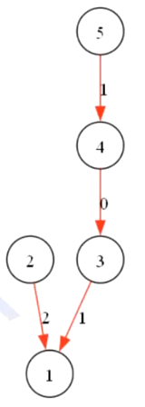

# 数据结构

- [数据结构](#数据结构)
  - [单调队列](#单调队列)
    - [单调队列引入](#单调队列引入)
      - [引入问题滑动窗口](#引入问题滑动窗口)
    - [单调队列例题](#单调队列例题)
      - [P1714 切蛋糕](#p1714-切蛋糕)
        - [P1714题解](#p1714题解)
  - [单调栈](#单调栈)
  - [并查集](#并查集)
    - [并查集基础](#并查集基础)
      - [并查集查询](#并查集查询)
      - [并查集合并](#并查集合并)
    - [带权并查集](#带权并查集)
      - [带权并查集例题](#带权并查集例题)
        - [P2024 NOI2001食物链](#p2024-noi2001食物链)
          - [P2024题解](#p2024题解)
    - [可撤销并查集](#可撤销并查集)
    - [并查集例题](#并查集例题)
      - [并查集例题1](#并查集例题1)
        - [并查集例题1题解](#并查集例题1题解)
      - [并查集例题2](#并查集例题2)
        - [并查集例题2题解](#并查集例题2题解)
      - [并查集例题3](#并查集例题3)
        - [并查集例题3题解](#并查集例题3题解)
  - [堆](#堆)
  - [线段树](#线段树)
  - [树状数组](#树状数组)
  - [Trie](#trie)

## 单调队列

### 单调队列引入

#### 引入问题滑动窗口

> 如果有人比你小还比你强，那你就没有任何用了 —— noip

有 $n$ 个 oier ，每个 oier 有成绩和考试，保证给定数据中 oier 的出生年份单调，求每 $k$ 个年份时这 $n$ 个 oier 的最大成绩。

伪代码：

```cpp
deque<pair<int,int>> q; // 成绩，年份
while(!q.empty() && newgrade>q.back()) q.pop_back;
q.push_back(newgrade,newyear);
while(q.front().second要退役){
    q.pop_front();
}

最大值q.front().first
```

时间复杂度 $O(n)$ （均摊复杂度，可能某次while执行很久，可能某次很快）

### 单调队列例题

#### P1714 切蛋糕

[题目链接](https://www.luogu.com.cn/problem/P1714)

有一个长方形的蛋糕，被不同的色彩分成了 $N$ 个相同的小块，每个小块有着对应的幸运值。

小 Z 作为寿星，希望吃到的蛋糕的幸运值最大，但是他最多只能吃 $M (M \le N)$

你需要在这 $N$ 小块蛋糕中找出连续的几块，使得其上总幸运值最大。

形式化地，在数列 ${p_n}$ 中，找出一个长度小于 $M$ 的子段 $[l, r]$，最大化 $\sum^{r}_{i - l} {p_i}$

$1 \le n \le 5 \times 10^5$

##### P1714题解

---

## 单调栈

---

## 并查集

### 并查集基础

基础操作：合并、查询

#### 并查集查询

对于给定的 $a$，沿着树向上移动知道根节点即可

在合并的过程中的每个节点都属于这个集合，所以将父亲节点直接设为根即可。

#### 并查集合并

合并两个集合时，可以将一个集合的根节点设为另一个集合的根节点。

为了防止退化，可以将节点较少或深度较小的一棵树连接到令一颗上。

### 带权并查集

我们可以在并查集的边上维护某种值，在路径压缩时产生运算。

#### 带权并查集例题

##### P2024 NOI2001食物链

[题目链接](https://www.luogu.com.cn/problem/P2024)

动物王国中有三类动物 $A,B,C$，这三类动物的食物链构成了有趣的环形。$A$ 吃 $B$，$B$ 吃 $C$，$C$ 吃 $A$。

现有 $N$ 个动物，以 $1 \sim N$ 编号。每个动物都是 $A,B,C$ 中的一种，但是我们并不知道它到底是哪一种。

有人用两种说法对这 $N$ 个动物所构成的食物链关系进行描述：

- 第一种说法是 `1 X Y`，表示 $X$ 和 $Y$ 是同类。
- 第二种说法是`2 X Y`，表示 $X$ 吃 $Y$。

此人对 $N$ 个动物，用上述两种说法，一句接一句地说出 $K$ 句话，这 $K$ 句话有的是真的，有的是假的。当一句话满足下列三条之一时，这句话就是假话，否则就是真话。

- 当前的话与前面的某些真的话冲突，就是假话；
- 当前的话中 $X$ 或 $Y$ 比 $N$ 大，就是假话；
- 当前的话表示 $X$ 吃 $X$，就是假话。

你的任务是根据给定的 $N$ 和 $K$ 句话，输出假话的总数。

###### P2024题解

考虑维护带权并查集，对每次给定的话进行查询与合并。

具体的，对于并查集中的每两个节点，使用 $0$ 表示互为同类， $1$ 表示父亲吃儿子， $2$ 表示儿子吃父亲。

对于每句话 `1/2 X Y`，查询 $X, Y$ 之间的关系，若无冲突便合并即可，注意路径压缩时的运算。



### 可撤销并查集

对于一开始相互独立的 $n$ 个点，维护以下两种操作共 $q$ 次：

1. 给定 $a, b$ 两个点，判断是否在同一个联通块中，如不在则在 $a, b$ 间连边。
2. 撤销最后的若干次操作 $1$

要求复杂度 $O(q \log n)$

考虑用栈记录最近操作 $fa_x \leftarrow y$ ，每次撤销弹出栈顶，并将 $fa_x \leftarrow x$

因为要保证可逆，所以不能路径压缩，只能启发式合并。

### 并查集例题

#### 并查集例题1

有 $n$ 个点，初始时均为孤立点。

接下来有 $m$ 次连边操作，第 $i$ 次在 $a_i, b_i$ 之间连一条边。

接下来有 $q$ 次询问，每次询问两个点在第几次加边操作联通。

$1 \le n, m, q \le 10^5$

##### 并查集例题1题解

考虑对于每一次合并的 $a_i, b_i$，若两个点不联通，则在另外一颗树中连接 $a_i, b_i$，边权为 $i$。

每次查询就是在令一颗树中找到 $u, v$ 路径上边权最大值，可以使用树上倍增维护。

#### 并查集例题2

有一个长度为 $n$ 的 $01$ 序列 $a_1, \dots, a_n$，一开始全是 $0$。接下来进行如下 $m$ 次操作：

- $a_x \leftarrow 1$
- 输出 $\min\{x \in [l,r], a_x = 0\}$

$1 \le n, m \le 10^6$

##### 并查集例题2题解

建立并查集，使得 $i$ 所在联通块的根节点为 $i$ 后面第一次出现 $0$ 的位置，初始  $f_i = i$

对于每一次 $a_x \leftarrow 1$，如果 $a_x$ 原先不为 $1$，则令 $f_x = f_{x - 1}$

每次查询输出 $x$ 的祖先。

#### 并查集例题3

给定一颗 $n$ 个节点的树，接下来有 $m$ 次操作：

- 加一条 $a_i$ 到 $b_i$ 的边。
- 询问两个点之间是否存在至少两条**边不相交**的路径。

**边不相交：指的是两个路径没有公共边。**

$1 \le n, m \le 10^6$

##### 并查集例题3题解

前置知识：[强联通分量](../树上问题，图论/树上问题，图论.md#强联通分量)

---

## 堆

---

## 线段树

---

## 树状数组

---

## Trie

---
