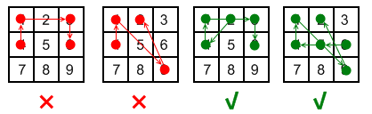

# 动态规划

- [动态规划](#动态规划)
  - [背包](#背包)
    - [01背包](#01背包)
    - [完全背包](#完全背包)
    - [多重背包](#多重背包)
    - [混合背包](#混合背包)
    - [分组背包](#分组背包)
    - [有依赖的背包](#有依赖的背包)
    - [背包问题的第 $k$ 优解](#背包问题的第-k-优解)
    - [背包例题](#背包例题)
      - [P4141 消失之物](#p4141-消失之物)
        - [P4141题解](#p4141题解)
        - [P4141代码](#p4141代码)
  - [区间](#区间)
    - [区间 dp 例题](#区间-dp-例题)
      - [P1775 石子合并](#p1775-石子合并)
        - [P1775题解](#p1775题解)
        - [P1175变式（P1880）](#p1175变式p1880)
          - [P1880法1](#p1880法1)
          - [P1880法2](#p1880法2)
          - [P1880代码](#p1880代码)
      - [P10236 D. 排卡](#p10236-d-排卡)
        - [P10236题解](#p10236题解)
        - [P10236代码](#p10236代码)
      - [P1450 硬币购物](#p1450-硬币购物)
        - [P1450题解](#p1450题解)
        - [P1450代码](#p1450代码)
      - [P5365 英雄联盟](#p5365-英雄联盟)
        - [P5365题解](#p5365题解)
        - [P5365代码](#p5365代码)
      - [LOJ3254 集邮比赛 3](#loj3254-集邮比赛-3)
        - [LOJ3254题解](#loj3254题解)
        - [LOJ3254代码](#loj3254代码)
  - [树形](#树形)
    - [选择节点类树形 dp](#选择节点类树形-dp)
    - [树形背包类树形 dp](#树形背包类树形-dp)
    - [树形 dp 例题](#树形-dp-例题)
      - [树上最小点覆盖](#树上最小点覆盖)
        - [树上最小点覆盖题解](#树上最小点覆盖题解)
      - [P2014 选课](#p2014-选课)
        - [P2014题解](#p2014题解)
      - [P1352 没有上司的舞会](#p1352-没有上司的舞会)
        - [P1352题解](#p1352题解)
        - [P1352代码](#p1352代码)
      - [P2899 Cell Phone Network G](#p2899-cell-phone-network-g)
        - [P2899题解](#p2899题解)
        - [P2899代码](#p2899代码)
  - [换根](#换根)
    - [换根 dp 例题](#换根-dp-例题)
      - [P3478 STA-Station](#p3478-sta-station)
        - [P3478题解](#p3478题解)
        - [P3478代码](#p3478代码)
      - [CF543D Road Improvement](#cf543d-road-improvement)
        - [CF534D题解](#cf534d题解)
        - [CF534D代码](#cf534d代码)
  - [状压](#状压)
    - [引入例题 旅行商问题](#引入例题-旅行商问题)
      - [旅行商问题题解](#旅行商问题题解)
    - [常见技巧](#常见技巧)
      - [位运算操作](#位运算操作)
      - [popcount](#popcount)
    - [状压 dp 例题](#状压-dp-例题)
      - [P2831 愤怒的小鸟](#p2831-愤怒的小鸟)
        - [P2831题解](#p2831题解)
        - [P2831代码](#p2831代码)
      - [P1896 互不侵犯](#p1896-互不侵犯)
        - [P1896题解](#p1896题解)
        - [P1896代码](#p1896代码)
      - [P4460 解锁屏幕](#p4460-解锁屏幕)
        - [P4460题解](#p4460题解)
        - [P4460代码](#p4460代码)
      - [P6239 奇怪的道路](#p6239-奇怪的道路)
        - [P6239题解](#p6239题解)
        - [P6239代码](#p6239代码)

## 背包

### 01背包

给定 $n$ 个物品，第 $i$ 个的体积为 $v_i$，价值为 $w_i$，每个物品至多选一次，求最大价值。

转移方程 $f(i, j) = max(f(i - 1, j), f(i - 1, j - v_i) + w_i)$

时间复杂度 $O(nm)$

### 完全背包

给定 $n$ 个物品，第 $i$ 个的体积为 $v_i$，价值为 $w_i$，每个物品无限拿，求最大价值。

转移方程 $f(i, j) = max(f(i - 1, j), f(i, j - v_i) + w_i)$

时间复杂度 $O(nm)$

### 多重背包

给定 $n$ 个物品，第 $i$ 个的体积为 $v_i$，价值为 $w_i$，每个物品有 $t_i$ 个，求最大价值。

考虑 $t_i$ 的二进制，若第 $k$ 位为 $1$，则新建一个体积为 $v_i 2^k$，价值为 $w_i 2^k$ 的物品，转换为[01背包](#01背包)。

时间复杂度 $O(nm \log m)$

### 混合背包

就是将[01背包](#01背包)，[完全背包](#完全背包)，[多重背包](#多重背包)混合在一起。

因为 dp 数组并没有规定是哪种背包，所以共用一个数组， 分三类做即可。时间复杂度 $O(nm)$

### 分组背包

有 $n$ 个物品，第 $i$ 个物品价值为 $w_i$ 体积为 $v_i$ 并且属于第 $t_i$ 组。

有一个容量为 $m$ 的背包，问在每组最多选一个且体积不超过 $W$ 的条件下的最大价值。

一组一组进行考虑。对于每一组，从大到小枚举 $j$ 表示这一组的体积，然后枚举每一个物品即可。

核心代码：

```cpp
for (int i = 1; i <= m; ++i)
{
    for (int j = W; j >= 0; --j)
    {
        for (auto x : items[i])
        {
            if (j >= v[x])
                f[j] = max(f[j], f[j - v[x]] + w[x]);
        }
    }
}
```

### 有依赖的背包

金明有 $n$ 元钱， $m$ 个物品，第 $i$ 件物品的价格为 $v_i$，重要度为 $p_i$。有些物品是主件，可以直接购买；有些物品是附件，要先买下主件才能买附件。

求最大的 $v_i \times p_i$

$n \le 3.2 \times 10^4, m \le 60, 0 \le v_i \le 10^4, 1 \le p_i \le 5$。每个主件最多有两个附件。

对于每个主件 $A$ 以及附件 $B, C$，只有这几种选法： $\varnothing, \{A\}, \{A, B\}, \{A, C\}, \{A, B, C\}$

考虑将其转换为每组 $4$ 个物品的[分组背包](#分组背包)求解。

### 背包问题的第 $k$ 优解

普通01背包只能求出最优解，在普通背包上稍作改动，增加一维用于记录当前状态前 $k$ 优解，即可求出背包问题的第 $k$ 优解。

具体的，考虑原本的转移： $f_{i, j} = max(f_{i - 1, j}, f_{i - 1, j - v_i} + w_i)$

所有不选 $i$ 的构成序列 $[f_{i - 1, j, 1}, ...,f_{i - 1, j, k}]$

所有选 $i$ 的构成序列 $[f_{i - 1, j - v_i, 1} + w_i, ...,f_{i - 1, j - v_i, k} + w_i]$

合并后即得到 $f_{i, j, k}$

时间复杂度 $O(nmk)$

### 背包例题

#### P4141 消失之物

[题目链接](https://www.luogu.com.cn/problem/P4141)

有 $n$ 个物品。体积分别是 $w_1, w_2, \dots, w_n$，每个只有一个。

记 $cnt(i, x)$ 表示在丢掉第 $i$ 件物品的情况下装满容量为 $x$ 的背包的方案数。

输出一个 $n \times m$ 的矩阵，表示每一个 $cnt(i, x)$ 的个位数。（ $m$ 为输入的背包容量最大值）

##### P4141题解

先按照不丢东西的方法跑一次背包。

然后考虑丢掉一件物品后造成的影响。

因为本题目要求的是方案数而不是最优值，所以每一个物品的贡献都可以撤销。

考虑转移方程

$$
f_j = g_j + g_{j - w_i}\\
\Downarrow\\
g_j = f_j - g_{j - w_i}
$$

因为需要用到更小的 $g_{j - w_i}$，所以从小到大循环即可逆推出 $g_i$。

##### P4141代码

```cpp
#pragma GCC optimize(3, "Ofast", "inline")
#include <bits/stdc++.h>
using namespace std;
const int N = 2e5 + 10;
int n, m, w[N], f[N], g[N];
int main()
{
#ifndef ONLINE_JUDGE
    freopen("1.in", "r", stdin);
#endif
    scanf("%d%d", &n, &m);
    for (int i = 1; i <= n; ++i)
        scanf("%d", &w[i]);
    f[0] = 1;
    for (int i = 1; i <= n; ++i)
        for (int j = m; j >= w[i]; --j)
            f[j] = (f[j] + f[j - w[i]]) % 10;
    for (int i = 1; i <= n; ++i)
    {
        memset(g, 0, sizeof(g));
        g[0] = 1;
        for (int j = 1; j <= m; ++j)
        {
            if (j - w[i] >= 0)
                g[j] = (f[j] - g[j - w[i]] + 10) % 10;
            else
                g[j] = f[j] % 10;
            printf("%d", g[j] % 10);
        }
        puts("");
    }
    return 0;
}

```

---

## 区间

区间dp是一种特殊的dp方式，他以每个子区间为一个状态，一般以 $f_{l, r}$ 表示 $[l, r]$ 的状态。

### 区间 dp 例题

#### P1775 石子合并

[题目链接](https://www.luogu.com.cn/problem/P1775)

在一条路上有 $n$ 个棋子，第 $i$ 堆有 $a_i$ 枚，每次操作可以合并相邻的两堆棋子，能获得的得分为两堆棋子的总和。问最大总得分。

$n \le 300$

##### P1775题解

设 $f_{l, r}$ 表示 $[l, r]$ 这个区间的答案。

转移方程式则为

$$
f_{l, r} = \mathop{max}\limits_{i \le k \lt j}\{f_{i, k} + f_{k + 1, j}+\sum^{j}_{t = i} a_t\}
$$

这题代码就不放了，重点是下面的变式。

##### P1175变式（P1880）

若石子摆成一个环而非一条链，如何解决？

[题目链接](https://www.luogu.com.cn/problem/P1880)

###### P1880法1

做 $n$ 次，时间复杂度 $O(n^4)$

###### P1880法2

将序列循环一次拼接到后边，再去执行原来的 dp，最后答案则为

$$
max\{f_{1, n}, f_{2, n + 1}, \dots, f_{n, 2\times n - 1}\}
$$

复杂度 $O(n^3)$

###### P1880代码

```cpp
#include <bits/stdc++.h>

int n;
int a[500];

int f[500][500] = {0};
int fm[500][500] = {0};
int pre[500] = {0};
int ans_max = -1;
int ans_min = 0x7f7f7f7f;

int max(int a, int b)
{
    if (a > b)
        return a;
    return b;
}

int min(int a, int b)
{
    if (a < b)
        return a;
    return b;
}

int sum(int i, int j)
{
    return pre[j] - pre[i - 1];
}

int main()
{
    int i, j, k;
    scanf("%d", &n);
    for (i = 1; i <= n; i++)
    {
        scanf("%d", &a[i]);
        a[n + i] = a[i];
    }

    int len = (n << 1) - 1;
    for (i = 1; i <= len; i++)
    {
        pre[i] = pre[i - 1] + a[i];
    }

    memset(fm, 0x7f, sizeof(fm));
    for (i = 0; i <= 400; i++)
        fm[i][i] = 0;
    for (i = 2; i <= n; i++)
    {
        for (j = 1; j <= len - i + 1; j++)
        {
            for (k = j; k < j + i - 1; k++)
            {
                int m = f[j][k] + f[k + 1][j + i - 1];

                int xiao = fm[j][k] + fm[k + 1][j + i - 1];

                if (f[j][j + i - 1] < m)
                    f[j][j + i - 1] = m;

                if (fm[j][j + i - 1] > xiao)
                    fm[j][j + i - 1] = xiao;
            }
            f[j][j + i - 1] += sum(j, j + i - 1);
            fm[j][j + i - 1] += sum(j, j + i - 1);
        }
    }
    for (i = 1; i <= n; i++)
    {
        if (ans_max < f[i][i + n - 1])
            ans_max = f[i][i + n - 1];

        if (ans_min > fm[i][i + n - 1])
            ans_min = fm[i][i + n - 1];
    }
    printf("%d\n", ans_min);
    printf("%d", ans_max);

    return 0;
}
```

#### P10236 D. 排卡

[题目链接](https://www.luogu.com.cn/problem/P10236)

给定一个长度为 $n$ 的双端队列 $q$，进行 $n$ 次操作，第 $i$ 次操作令 $b_i \leftarrow q$ 的队头或队尾，并弹出那个元素。

要求构造操作方式，使得

$$
\sum^{n - 1}_{i = 1}pow(b_i, b_{i + 1}, 998244353)
$$

最大。

其中 $pow(a, b, p) = a^b \bmod p$

注意：只对于每次计算取模，后续加起来时不取模。

$n \le 10^3$

##### P10236题解

考虑使用区间 dp，使用 $f_{l, r, b}$ 表示 $b = 0$ 时，访问的数是左边， $b = 1$ 则表示右边， $[l, r]$ 区间内的答案。则转移方程为：

$$
f_{i + 1, j, 0} = max(f_{i + 1, j, 0}, f_{i, j, 0} + a^{a_i}_{i - 1}, f(i, j, 1) + a^{a_i}_{j + 1}) \\
f_{i, j - 1, 1} = max(f_{i, j - 1, 1}, f_{i, j, 1} + a^{a_i}_{j + `}, f(i, j, 0) + a^{a_i}_{i - 1}) \\
$$

时间复杂度为 $O(n^2)$

##### P10236代码

```cpp
#include <bits/stdc++.h>
using namespace std;
#define int long long
int t, n, a[1005], f[1005][1005][2], mod = 998244353;
int fast_pow(int a, int b, int c = mod)
{
    if (a == 0 && b == 0)
        return 0;
    int x, y, m = 1;
    y = a, x = b;
    while (b)
    {
        if (b % 2)
            m = m * a % c;
        a = a * a % c;
        b /= 2;
    }
    return m;
}

signed main()
{
    scanf("%lld", &t);
    while (t--)
    {
        scanf("%lld", &n);
        for (int i = 1; i <= n; i++)
            scanf("%lld", &a[i]);
        memset(f, 0, sizeof(f));
        //-----------------dp-------------------//
        for (int len = 1; len < n; len++)
            for (int i = 1; i + len <= n; i++)
            {
                f[i][i + len][0] = max(f[i + 1][i + len][0] + fast_pow(a[i], a[i + 1]), f[i + 1][i + len][1] + fast_pow(a[i], a[i + len]));             // left
                f[i][i + len][1] = max(f[i][i + len - 1][0] + fast_pow(a[i + len], a[i]), f[i][i + len - 1][1] + fast_pow(a[i + len], a[i + len - 1])); // right
            }
        printf("%lld\n", max(f[1][n][0], f[1][n][1]));
    }
    return 0;
}
```

#### P1450 硬币购物

[题目链接](https://www.luogu.com.cn/problem/P1450)

共有 $4$ 种硬币。面值分别为 $c_1, c_2, c_3, c_4$。

某人去商店买东西，去了 $n$ 次，对于每次购买，他带了 $d_i$ 枚 $i$ 种硬币，想购买 $s$ 的价值的东西。请问每次有多少种付款方法。

$1 \le n \le 1000$

##### P1450题解

若直接套用多重背包，肯定爆时间。

##### P1450代码

```cpp
#include <bits/stdc++.h>
using namespace std;
unsigned long long c[5];
int n;
unsigned long long d[5];
unsigned int t;
int main()
{
#ifndef ONLINE_JUDGE
    freopen("3.in", "r", stdin);
#endif
    scanf("%llu%llu%llu%llu%d", &c[0], &c[1], &c[2], &c[3], &n);
    while (n--)
    {
        scanf("%llu%llu%llu%llu%u", &d[0], &d[1], &d[2], &d[3], &t);
        vector<unsigned long long> f(t + 1);
        f[0] = 1;
        for (size_t o = 0; o < 4; ++o)
        {
            unsigned int w = c[o], m = d[o];
            vector<unsigned long long> g(f);
            vector<unsigned long long> s(w);
            for (unsigned long long i = 0; i * w <= t; ++i)
                for (unsigned long long j = 0; j < w && i * w + j <= t; ++j)
                {
                    g[i * w + j] += s[j];
                    s[j] += f[i * w + j];
                    if (i >= m)
                        s[j] -= f[(i - m) * w + j];
                }
            f = g;
        }
        printf("%llu\n", f.back());
    }
    return 0;
}
```

#### P5365 英雄联盟

[题目链接](https://www.luogu.com.cn/problem/P5365)

有 $n$ 个英雄，每个英雄有 $k_i$ 个皮肤i，一个英雄所有的皮肤价格相同，都是 $c_i$，现在要买皮肤来进行展示，展示的方案就是每个英雄选择一个皮肤展示，求如何花最少的前使得总的展示方案 $\le m$。

$n \le 130, m \le 10^{17}, k_i \le 10, c_i \le 200$

##### P5365题解

朴素方案是 $f_{i, j}$ 表示前 $i$ 个物品，方案数至少为 $j$ 的最小花费，但是观察到 $m \le 10^17$，方案数过多，肯定存不下。

于是考虑使用 $f_{i, j}$ 表示前 $i$ 个物品，价格最大为 $j$ 的最大方案数，就转换为了一个多重背包，转移为：

$$
f_{i + 1, j + c_i \times t} = max \{f(i, j)\times t\}
$$

其中 $t$ 表示买了 $t$ 个皮肤。

时间复杂度 $O(n^2kc)$

- 注意：为了防止溢出，方案数要与 $m$ 取 min

##### P5365代码

```cpp
#include <bits/stdc++.h>
// fi = max(fi, f[i - g * c[p]] * g)
#define int long long
const int N = 1000005;
using namespace std;
int f[N], k[N], c[N], n, m, sq, ans;
signed main()
{
    f[0] = 1;
#ifndef ONLINE_JUDGE
    freopen("4.in", "r", stdin);
#endif
    scanf("%lld%lld", &n, &m);
    for (int p = 1; p <= n; ++p)
        scanf("%lld", &k[p]);
    for (int p = 1; p <= n; ++p)
    {
        scanf("%d", &c[p]);
        sq += k[p] * c[p];
    }
    for (int p = 1; p <= n; ++p)
        for (int i = sq; i >= 0; --i)
            for (int g = 0; g <= k[p] && g * c[p] <= i; ++g)
                f[i] = max(f[i], f[i - g * c[p]] * g);
    while (ans < sq && f[ans] < m)
        ++ans;
    printf("%d\n", ans);
}
```

#### LOJ3254 集邮比赛 3

[题目链接](https://loj.ac/p/3254)

JOI 君生活的 IOI 国有一个著名的湖泊，今天一场集邮大会在湖边举行。

绕湖一圈总共有 $N$ 种邮票可以收集，编号分别为 $1\ldots N$，收集点绕湖顺时针排列。湖的周长为 $L$，第 $i$ 张邮票 ($1 \le i \le N$) 的收集点在距离出发点顺时针走 $X_i$ 米的位置。

参赛者在比赛开始的时候要站在出发点的位置，当大会开始时，参赛者可以绕湖顺时针或者逆时针移动，参赛者能够得到第 $i$ 张邮票 ($1 \le i \le N$) 当且仅当他到达收集点的时间在比赛开始时的 $T_i$ 秒以内（含）。

JOI 君也是集邮大会的参与者。他的移动速度是每秒钟 $1$ 米，你可以认为只有移动才会消耗时间。

计算他最多能收集到多少种邮票。

$n \le 200, 2 \le L \le 10^9, 0 \le T_i \le 10^9$

##### LOJ3254题解

##### LOJ3254代码

---

## 树形

树形 dp 本质上只是一种思想，就是把 dp 建立在树形结构上。树形 dp 最主要的特征就是考虑树上的父子关系，例如选择一个节点必须选择或不能选择父亲等。

常见的树形 dp 有两种模型：

- 选择节点类，转移方程类似 $f_{i, 0} = f_{j, 1}, f_{i, 1} = max(f_{j, 0}, f_{j, 1})$，主要是处理树上某个节点是否选择。
- 树形背包类，转移方程类似 $f_{v, k} = f_{u, k} + val, f_{u, k} = max(f_{v, k}, f_{v, k - 1})$，主要是处理树上背包问题。

### 选择节点类树形 dp

这一类的 dp 主要是处理某一个节点是否对答案产生贡献，即是要选择该答案到答案集合中取。所以在设计转移方程 $f_{i, 0/1}$ 时，第二维则表示该节点是否选取。

### 树形背包类树形 dp

该类 dp，通常是在树上选择一个包含根的连通块，或者背包存在依赖关系，或者需要知道每个点的子树选了多少。

### 树形 dp 例题

#### 树上最小点覆盖

给定一个 $n$ 个节点的树，要求选择一个点的集合，使得树上每一条边都与其中至少一个点相连，同时让集合大小最小。

$n \le 10^6$

##### 树上最小点覆盖题解

使用状态 $f_{i, 0/1}$ 表示节点 $i$ 选择或不选择。

考虑 DFS 进行状态转移，对于节点 $u$，以及其子节点集合 $V_s$，有如下转移：

$$
\begin{aligned}
f_{u, 1} &= \sum_{v \in V_s} min(f_{v, 0}, f_{v, 1}) \\
f_{u, 0} &= \sum_{v \in V_s} f_{v, 1} \\
\end{aligned}
$$

#### P2014 选课

[题目链接](https://www.luogu.com.cn/problem/P2014)

有 $n$ 个学科，每门课有个学分，每门课程有一门或者没有先修课（若课程 $a$ 是课程 $b$ 的先修课，则必须先修课程 $a$ 在能学习课程 $b$）。一个学生要从这些课程内选择 $m$ 门课程进行学习，问他能获得的最大学分。

$1 \le n, m \le 300$

##### P2014题解

考虑构造树形关系，在 dfs 时转移。记 $f_{u, i, j}$ 表示 $u$ 为根的子树中，已经遍历了 $i$ 课子树，选择了 $j$ 门课的最大学分。转移方程如下：

$$
f_{u, i, j} = \mathop{max}_{k \le min(j, sz_v)}(f_{u, i - 1, j - k} + f_{v, s_v, k})
$$

其中 $s_v$ 表示 $v$ 的子节点数量， $sz_v$ 表示以 $v$ 为根的树的节点数量。

#### P1352 没有上司的舞会

[题目链接](https://www.luogu.com.cn/problem/P1352)

某个大学有 $n$ 个职员，编号为 $1 \dots n$，他们之间有从属关系，也就是说他们的关系构成一棵树，父节点则为他们的直接上司。

现在有一个舞会，每个职员去了之后会增加 $r_i$ 的快乐指数，但是若一个职员的直接上司去了，那这个职员就不肯去了。

求最大快乐指数。

$1 \le n \le 6000, -128 \le r_i \le 127$

##### P1352题解

记录 $f_{u, 0/1}$ 表示以 $u$ 为根的子树，且 $u$ 选或不选的最大快乐指数， $V_u$ 为节点 $u$ 的孩子节点集合。转移方程为：

$$
\begin{aligned}
f_{u, 0} &= \sum_{v \in V_u} max(f_{v, 1}, f_{v, 0}) \\
f_{u, 1} &= r_u + \sum_{v \in V_u} f_{v, 0} \\
\end{aligned}
$$

时间复杂度 $O(n)$

##### P1352代码

```cpp
#include <stdio.h>
#include <vector>
using namespace std;
int n, fa[6005], f[6005][2], r[6005];
vector<int> child[6005];
void dp(int m)
{
    for (int i = 0; i < child[m].size(); ++i)
    {
        dp(child[m][i]);
    }
    f[m][1] = r[m];
    for (int i = 0; i < child[m].size(); ++i)
    {
        f[m][0] += max(f[child[m][i]][0], f[child[m][i]][1]);
        f[m][1] += f[child[m][i]][0];
    }
    return;
}
int main()
{
    scanf("%d", &n);
    for (int i = 1; i <= n; ++i)
    {
        scanf("%d", &r[i]);
    }
    for (int i = 1; i < n; ++i)
    {
        int l, k;
        scanf("%d%d", &l, &k);
        fa[l] = k;
        child[k].push_back(l);
    }
    int root = 1;
    while (fa[root] != 0)
    {
        root = fa[root];
    }
    dp(root);
    printf("%d\n", max(f[root][0], f[root][1]));
    return 0;
}
```

#### P2899 Cell Phone Network G

[题目链接](https://www.luogu.com.cn/problem/P2899)

有一个有 $n$ 个节点的树形地图，一个节点如果建立电话干，那么和他直接相连的顶点也会被覆盖到。问最少建多少个电话杆，可以使所有顶点被覆盖。

$1 \le n \le 10^4$

##### P2899题解

该题目的重点在于，一个点的选取不仅会影响孩子节点，还会影响父亲节点，所以转移会复杂一些。

- 记 $f_{i, 0}$ 表示选 $i$，且以 $i$ 为根的子树每个点都被覆盖的最少信号塔部署数量。
- 记 $f_{i, 1}$ 表示不选 $i$，且 $i$ 被儿子覆盖的最少信号塔数量。
- 记 $f_{i, 2}$ 表示不选 $i$，且以 $i$ 为根的子树每个点都被覆盖的最少信号塔部署数量，即 $i$ 要被父节点覆盖。

记 $V_i$ 为 $i$ 的子节点点集。

转移方程：

$$
f_{i, 0} = 1 + \sum_{v \in V_i} min(f_{v, 0}, f_{v, 1}, f_{v, 2}) \\
f_{i, 2} = \sum_{v \in V_i} min(f_{v, 0}, f_{v, 1}) \\
$$

如果存在 $k \in V_i \And f_{k, 0} \le f_{k, 1}$，则

$$f_{i, 1}= \sum_{v \in V_i} min(f_{v, 1}, f_{v, 0})$$

否则

$$
t \leftarrow \{min(f_{v, 0} - f_{v, 1}), v \in V_i\}\\
f_{i, 1}= \sum_{v \in V_i} min(f_{v, 1}, f_{v, 0}) + t
$$

##### P2899代码

```cpp
#include <bits/stdc++.h>
using namespace std;
const int N = 100005, INF = 0x7f7f7f7f;
int n, m, dp[N][5];
int nxt[N], to[N];
int head[N], cnt;
void add(int too, int from)
{
    to[++cnt] = too;
    nxt[cnt] = head[from];
    head[from] = cnt;
}
void dfs(int u, int fa)
{
    int tot = 0, g[N];
    dp[u][0] = 1;
    for (int i = head[u]; i; i = nxt[i])
    {
        int v = to[i];
        if (v == fa)
            continue;
        dfs(v, u);
        dp[u][0] += min(dp[v][0], min(dp[v][1], dp[v][2]));
        dp[u][1] += dp[v][0];
        dp[u][2] += min(dp[v][0], dp[v][1]);
        g[++tot] = dp[v][1] - dp[v][0];
    }
    if (!tot)
        dp[u][1] = INF;
    else
    {
        sort(g + 1, g + 1 + tot);
        for (int i = 1; i < tot; i++)
        {
            if (g[i] < 0)
                dp[u][1] += g[i];
            else
                break;
        }
    }
    return;
}

int main()
{
#ifndef ONLINE_JUDGE
    freopen("5.in", "r", stdin);
#endif
    scanf("%d", &n);
    for (int i = 1; i < n; i++)
    {
        int x, y;
        scanf("%d%d", &x, &y);
        add(x, y), add(y, x);
    }
    dfs(1, 0);
    printf("%d", min(dp[1][0], dp[1][1]));
    return 0;
}
```

---

## 换根

换根 dp，又称作二次扫描，相比与普通的树形 dp，换根 dp 的特点是不具有固定的根节点。而最终要求的是哪个节点为根时答案最优。

换根 dp 解决的问题，便是在节点数为 $n$ 的树中，朴素做法则为进行 $n$ 次树形 dp，而换根 dp 则是求出换根所带来的影响，以降低 $n$ 倍的复杂度。

换根后，大部分的情况不变，变得只是旧根和新根的子节点的父子关系，所以只需要处理这些关系后，即可单次树形 dp 求出所有点为根的答案。

主要步骤：

1. 定根求解
2. 计算换根

### 换根 dp 例题

#### P3478 STA-Station

[题目链接](https://www.luogu.com.cn/problem/P3478)

给定一个 $n$ 个点的树，求出一个节点，使得这个节点为根时，所有节点的深度之和最大。

$1 \le n \le 10^6$

##### P3478题解

若直接进行 $n$ 次树形 dp，时间肯定会爆。

考虑固定 $1$ 号节点为根，则可以直接求出以 $u$ 为根的子树内所有节点的深度和 $f_u$。

接下来考虑换根，使用 $f_u$ 表示以 $u$ 为根节点时所有节点的深度和。

记 $u$ 为 $v$ 的父亲， $sz_u$ 表示以 $u$ 为根的子树大小（以 $1$ 为根时），则转移方程为

$$
f_v = f_u - sz_v + (sz_1 - sz_v)
$$

这个转移方程的含义是：

- 第一个 $-sz_v$ 表示根节点为 $v$ 时，原来根节点为 $v$ 的子树的所有深度都 $-1$
- 第二个 $+(sz_1 - sz_v)$ 表示根节点为 $v$ 时，原来根节点为 $u$ 且不在 $v$ 子树内的节点深度都 $+1$

这样就可以快速求出换根后对答案产生的贡献。

##### P3478代码

```cpp
#include <bits/stdc++.h>
using namespace std;
const int N = 3e6 + 10;
int n;
int to[N], nxt[N];
int dep[N], head[N], tot;
void add(int a, int b)
{
    to[++tot] = b, nxt[tot] = head[a], head[a] = tot;
}
int siz[N];
long long dp[N];
void search(int u, int fa)
{
    siz[u] = 1, dp[u] = dep[u];
    for (int i = head[u]; i; i = nxt[i])
    {
        int v = to[i];
        if (v == fa)
            continue;
        dep[v] = dep[u] + 1;
        search(v, u);
        siz[u] += siz[v], dp[u] += dp[v];
    }
}
void chroot(int u, int fa)
{
    for (int i = head[u]; i; i = nxt[i])
    {
        int v = to[i];
        if (v == fa)
            continue;
        dp[v] = dp[u] - siz[v] + n - siz[v];
        chroot(v, u);
    }
}
int main()
{
#ifndef ONLINE_JUDGE
    freopen("3.in", "r", stdin);
#endif
    scanf("%d", &n);
    for (int i = 1; i < n; i++)
    {
        int a, b;
        scanf("%d%d", &a, &b);
        add(a, b);
        add(b, a);
    }
    search(1, 0);
    chroot(1, 0);
    int ans = 0;
    for (int i = 1; i <= n; i++)
        ans = (dp[ans] < dp[i]) ? i : ans;
    printf("%d\n", ans);
}
```

#### CF543D Road Improvement

[题目链接](https://www.luogu.com.cn/problem/CF543D)

一个国家有 $n$ 座城市和 $n - 1$ 条双向道路，你可以沿道路从一个城市到任意一个其他城市。这些城市被编号 $1 \dots n$

所有最初的城市都是不良的，但是政府想要改善道路情况。我们认为从首都 $x$ 到其他城市的道路上的不良道路数量 $\le 1$，则市民会感到满意。求对于每个可能的 $x$，求出所有能满足市民条件的改善道路方案的数量 $\bmod 10^9 + 7$

$2 \le n \le 2 \times 10^5$

##### CF534D题解

考虑定根的情况，记 $f_i$ 表示以 $i$ 为根的子树改良方案数量，那么对于所有叶子节点， $f_i = 1$

对于非叶子节点 $u$，记 $v \in V_u$，若 $u, v$ 之间没有改良，那么 $v$ 子树内所有道路都要改良，方案数为 $1$。如果这条道路改良了，那么方案数为 $f_v$。转移为

$$f_u = \prod_{v \in V_u} (f_v + 1)$$

接下来考虑换根。

发现在将根从 $u$ 变为他的儿子 $v$ 的时候，只有 $f_u, f_v$ 发生变化。

设 $f'_u$ 为换根后 $f_u$ 的新值。则

$$
f'_u = \prod_{k \in V_u, k \not= v}(f_k + 1) \\
f'_v = f_v(f_u + 1) \\
$$

即可换根求解。

##### CF534D代码

```cpp
#include <bits/stdc++.h>
const int mod = 1e9 + 7, M = 5e5 + 10;
using namespace std;
int n, nxt[M], head[M], to[M], tot;
long long F[M], ans[M];
vector<long long> F1[M], F2[M];
int read()
{
    char c = getchar();
    int ans = 0;
    while (c < '0' || c > '9')
        c = getchar();
    while (c >= '0' && c <= '9')
        ans = (ans << 1) + (ans << 3) + (c ^ 48), c = getchar();
    return ans;
}
void add(int u, int v)
{
    nxt[++tot] = head[u], head[u] = tot, to[tot] = v, nxt[++tot] = head[v], head[v] = tot, to[tot] = u;
}
void dfs1(int x, int fa)
{
    F[x] = 1;
    for (int i = head[x]; i; i = nxt[i])
        if (to[i] != fa)
            dfs1(to[i], x), F[x] = F[x] * (F[to[i]] + 1) % mod;
}
void dfs2(int x, int fa)
{
    ans[x] = 1;
    for (int i = head[x]; i; i = nxt[i])
    {
        ans[x] = ans[x] * (F[to[i]] + 1) % mod;
        if (to[i] != fa)
            F1[x].push_back(F[to[i]] + 1), F2[x].push_back(F[to[i]] + 1);
    }
    for (int i = 1; i < F1[x].size(); i++)
        F1[x][i] = F1[x][i] * F1[x][i - 1] % mod;
    for (int i = F2[x].size() - 2; i >= 0; i--)
        F2[x][i] = F2[x][i] * F2[x][i + 1] % mod;
    int cnt = 0;
    for (int i = head[x]; i; i = nxt[i])
    {
        if (to[i] == fa)
            continue;
        F[x] = (fa ? F[fa] + 1 : 1);
        if (cnt > 0)
            F[x] = F[x] * F1[x][cnt - 1] % mod;
        if (cnt < F2[x].size() - 1)
            F[x] = F[x] * F2[x][cnt + 1] % mod;
        dfs2(to[i], x);
        ++cnt;
    }
}
int main()
{
    n = read();
    for (int i = 2; i <= n; i++)
        add(read(), i);
    dfs1(1, 0);
    dfs2(1, 0);
    for (int i = 1; i <= n; i++)
        printf("%lld ", ans[i]);
    return 0;
}
```

---

## 状压

状态压缩 dp，表示将一个集合压缩到一个二进制数来表示状态，常用于关于图中选择节点等的问题，这种问题的节点个数通常很少，一般 $\le 20$。并且，这种问题的转移通常与选择的节点顺序无关，只和最后一个选择的节点有关。

我们常用 $f_{S, u}$ 表示经过了 $S$ 中的节点，且最后一个经过的节点为 $u$ 的结果。

当然，状压 dp 也可以用在线性结构上，一维 $i$ 表示扫描进度，一维 $S$ 进行状态压缩。[（例题）](#p6239-奇怪的道路)

### 引入例题 旅行商问题

给定一个 $n$ 个顶点组成的带权有向图的距离矩阵 $d(i, j)$。要求从顶点 $0$ 出发，经过每个节点恰好一次后再回到节点 $0$

问经过的边权之和最短是多少。

$n \le 15$

#### 旅行商问题题解

所有的路线有 $(n - 1)!$ 种。

因为已经经过的点，除了最后一个，其他点的顺序对于后续没有影响，所以考虑使用 $f_{S, v}$ 表示已经经过了 $S$ 中的点，上一个经过的点是 $v$ 的情况下经过的边权之和最短的值。

但是因为数组下标不能为数组，所以用一个 $2^{15}$ 的 int 来表示状态，这便是状态压缩。即

$$
mask(S) = \sum_{i \in S} 2^i
$$

转移：

$$
f_{\varnothing, 0} = 0 \\
f_{S, v} + d(u, v) \rightarrow f_{S \cup u, u}, u \notin S
$$

### 常见技巧

#### 位运算操作

```cpp
1 << i // 只包含 i 的集合
(1 << n) - 1 // 1...n - 1 全集
if (S >> i & 1) // 判断 i in S
S | (1 << i) // S and i
S & ~(1 << i) // S without i
S | T // 并
S & T // 交
```

注意优先级：左右移 > 按位或，按位与 > 按位取反

#### popcount

popcount 定义：一个数的二进制中 $1$ 的个数。

常见求法：

- 内置函数 `__builtin_popcount(), __builtin_popcountll()`
- 预处理

```cpp
int n;
int c[1 << 20] = {0};
int main()
{
    for (int S = 1; S <= (1 << n); ++S)
        c[S] = c[S ^ (S & (-S))] + 1;
}
int query(long long x)
{
    return c[x & ((1 << 20) - 1)] + c[x >> 20];
}
```

### 状压 dp 例题

#### P2831 愤怒的小鸟

[题目链接](https://www.luogu.com.cn/problem/P2831)

平面上有若干只猪 $(x_i, y_i)$，小鸟的飞行轨迹为 $ax^2 + bx$。当一只猪在小鸟的飞行轨迹上，这只猪将会被消灭，且不会影响小鸟的飞行。求最受需要多少只鸟才能把所有猪消灭。

##### P2831题解

考虑用 $f_S$ 表示覆盖 $S$ 这个集合所需要的最小数量， $g_{i, j}$ 表示经过 $i, j$ 两个点的抛物线所经过的集合。

$f_{S|g_{i, j}} = min(f_{S|g_{i, j}}, f_S + 1)$

##### P2831代码

```cpp
```

#### P1896 互不侵犯

[题目链接](https://www.luogu.com.cn/problem/P1896)

在 $N \times N$ 的棋盘里面放 $K$ 个国王，使他们互不攻击，共有多少种摆放方案。国王能攻击到它上下左右，以及左上左下右上右下八个方向上附近的各一个格子，共 $8$ 个格子。

$1 \le N \le 9$，$0 \le K \le N \times N$

##### P1896题解

使用 $f_{i, j, l}$ 表示只考虑前 $i$ 行，第 $i$ 行按照编号 $j$ 的状态放置国王，且已经放置 $l$ 个国王。

因此，我们用二进制数 $sit_j$ 表示国王的放置情况，使用 $sta_j$ 表示该状态下的国王个数。因此，只需要在程序开始时枚举出行内的每种情况，转移的时候保证和上一行的情况不冲突即可。转移方程：

$$
f_{i, j, l} = \sum f_{i - 1, x, l - sta(j)} \\
(sit_x << 1) \And sit(j)==0 \\
(sit_x >> 1) \And sit(j)==0 \\
$$

##### P1896代码

```cpp
#include <bits/stdc++.h>
#define int long long
using namespace std;
int N, K, cnt, a[1024], b[1024], f[20][1024][90];
void dfs(int k, int mask, int count)
{
    if (k > N)
    {
        ++cnt;
        a[cnt] = mask;
        b[cnt] = count;
        return;
    }
    dfs(k + 1, mask * 2, count);
    if ((mask & 1) == 0 && count < K)
        dfs(k + 1, mask * 2 + 1, count + 1);
}
signed main()
{
    scanf("%lld%lld", &N, &K);
    dfs(1, 0, 0);
    f[0][1][0] = 1;
    for (int i = 1; i <= N; ++i)
    {
        for (int j = 1; j <= cnt; ++j)
        {
            for (int k = b[j]; k <= K; ++k)
            {
                for (int last = 1; last <= cnt; ++last)
                {
                    if (a[last] & a[j])
                        continue;
                    if ((a[last] << 1) & a[j])
                        continue;
                    if ((a[last] >> 1) & a[j])
                        continue;
                    f[i][j][k] += f[i - 1][last][k - b[j]];
                }
            }
        }
    }
    int ans = f[N][1][K];
    for (int j = 2; j <= cnt; ++j)
    {
        ans += f[N][j][K];
    }
    printf("%lld\n", ans);
    return 0;
}
```

#### P4460 解锁屏幕

[题目链接](https://www.luogu.com.cn/problem/P4460)

求平面上给定坐标的 $n$ 个点中选出一条点数不小于 $4$，且经过的路径上的点必须被选中，可以重复经过已经经过的点但是每个点只能被选中一次的路径数量。



$1 \le n \le 20$

##### P4460题解

考虑 $f_{S, i}$ 表示经过了 $S$，最后一个节点为 $i$ 的方案数。

转移时选择一个 $j$ 满足 $j \in S \And \forall k \in \{S - j\}, P_k \notin P_iP_j$

其中 $P_k \notin P_iP_j$ 表示 $k$ 不在 $i, j$ 的路径中。

这样的时间复杂度为 $O(2_nn^3)$，无法通过，需要至少降掉一个 $n$ 才可以通过。

于是考虑预处理 $g_{i, j}$ 表示 $P_i, P_j$ 经过的所有点的集合，枚举每一个点进行转移。

这样，复杂度就降为了 $O(n^22^n)$，可以通过。

##### P4460代码

```cpp
#include <bits/stdc++.h>
using namespace std;
const int MOD = 100000007;
pair<int, int> p[25];
int dp[2500005][25], ans;
int f[25][25]; // 过i，j必须经过的点
bool cmp(pair<int, int> a, pair<int, int> b)
{
    return a.first < b.first || (a.first == b.first && a.second < b.second);
}
long double work(int x1, int y1, int x2, int y2)
{
    if (x1 == x2)
        return INT_MAX;
    return 1.0 * (y1 - y2) / (x1 - x2);
}
int n;
int main()
{
#ifndef ONLINE_JUDGE
    freopen("1.in", "r", stdin);
#endif
    scanf("%d", &n);
    for (int i = 1; i <= n; i++)
        scanf("%d%d", &p[i].first, &p[i].second);
    // pre begin
    sort(p + 1, p + n + 1, cmp);
    for (int i = 1; i <= n; i++)
        for (int j = i + 1; j <= n; j++)
            for (int k = i + 1; k <= j - 1; k++)
                if (abs(work(p[i].first, p[i].second, p[k].first, p[k].second) - work(p[k].first, p[k].second, p[j].first, p[j].second)) <= 1e-7)
                    f[i][j] |= (1 << k), f[j][i] |= (1 << k);
    // pre end
    for (int i = 1; i <= n; i++)
        dp[1 << i][i] = 1;
    for (int i = 0; i < (1 << (n + 1)); i++)
        for (int j = 1; j <= n; j++)
            if (i & (1 << j))
                for (int k = 1; k <= n; k++)
                    if ((i & (1 << k)) == 0 && k != j && (i & f[j][k]) == f[j][k])
                        dp[i | (1 << k)][k] = (dp[i | (1 << k)][k] + dp[i][j]) % MOD;
    for (int i = 0; i < (1 << (n + 1)); i++)
        if (__builtin_popcount(i) >= 4)
            for (int j = 1; j <= n; j++)
                if (i & (1 << j))
                    ans = (ans + dp[i][j]) % MOD;
    printf("%d\n", ans);
    return 0;
}
```

#### P6239 奇怪的道路

[题目链接](https://www.luogu.com.cn/problem/P6239)

求有 $n$ 个点， $m$ 条边，每个点的度数都是偶数，且每条边连接的节点编号相差不超过 $k$ 的无向图的数量 $\bmod 10^9 + 7$。

$1 \le n, m \le 30, 1 \le k \le 8$

##### P6239题解

使用 $f(i, j, S)$ 表示考虑了前 $i$ 个点，一共连接了 $j$ 条边， $[i - k, i - 1]$ 内的点目前度数奇偶性为 $S$ 的方案数。考虑每次转移加入一个点。

##### P6239代码

---
