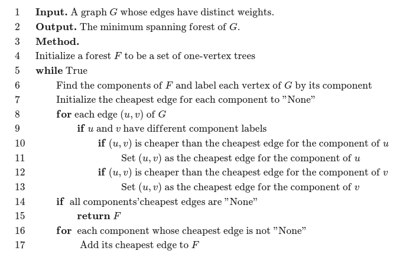
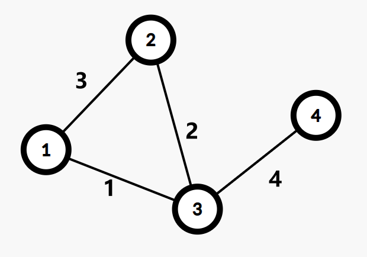
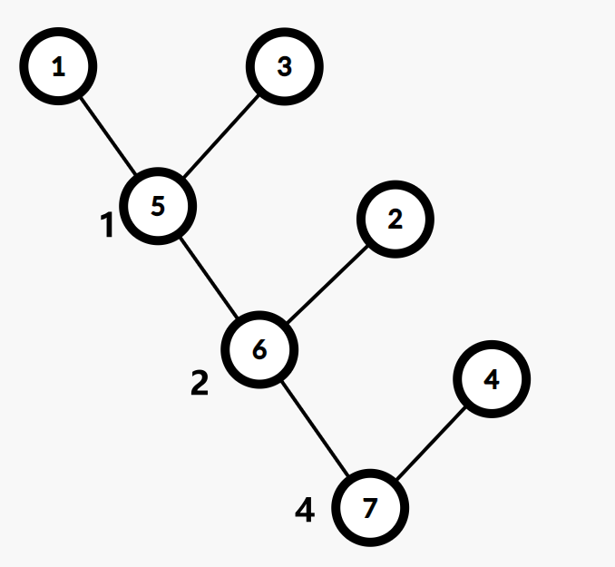
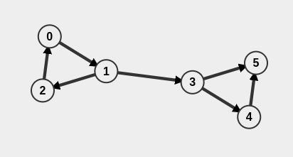

# 树上问题及图论

- [树上问题及图论](#树上问题及图论)
  - [LCA](#lca)
    - [LCA定义](#lca定义)
    - [LCA基本性质](#lca基本性质)
    - [LCA算法流程](#lca算法流程)
      - [朴素LCA](#朴素lca)
      - [倍增LCA](#倍增lca)
        - [倍增LCA参考代码](#倍增lca参考代码)
  - [树链剖分](#树链剖分)
    - [树链剖分概念](#树链剖分概念)
    - [树链剖分基本定义](#树链剖分基本定义)
    - [树链剖分约定定义](#树链剖分约定定义)
    - [树链剖分基本性质](#树链剖分基本性质)
    - [树链剖分例题](#树链剖分例题)
      - [树链剖分例题0](#树链剖分例题0)
        - [树链剖分例题0题解](#树链剖分例题0题解)
      - [P1967 货车运输](#p1967-货车运输)
        - [P1967题解](#p1967题解)
        - [P1967示例代码](#p1967示例代码)
  - [最短路](#最短路)
    - [最短路算法](#最短路算法)
      - [Floyd](#floyd)
      - [Bellman–Ford](#bellmanford)
      - [SPFA](#spfa)
      - [Dijkstra](#dijkstra)
    - [最短路例题](#最短路例题)
  - [最小生成树](#最小生成树)
    - [最小生成树定义](#最小生成树定义)
    - [最小生成树算法](#最小生成树算法)
      - [Kruskal 算法](#kruskal-算法)
        - [Kruskal部分代码](#kruskal部分代码)
      - [Prim 算法](#prim-算法)
        - [Prim代码（来自OI Wiki）](#prim代码来自oi-wiki)
      - [Boruvka 算法](#boruvka-算法)
        - [Boruvka伪代码](#boruvka伪代码)
    - [延伸：次小生成树](#延伸次小生成树)
      - [非严格次小生成树](#非严格次小生成树)
        - [非严格次小生成树求法](#非严格次小生成树求法)
      - [严格次小生成树](#严格次小生成树)
        - [严格次小生成树求法](#严格次小生成树求法)
    - [延伸：瓶颈生成树](#延伸瓶颈生成树)
      - [瓶颈生成树性质](#瓶颈生成树性质)
    - [延伸：Kruskal 重构树](#延伸kruskal-重构树)
      - [Kruskal重构树性质](#kruskal重构树性质)
    - [最小生成树例题](#最小生成树例题)
      - [CF609E Minimum spanning tree for each edge](#cf609e-minimum-spanning-tree-for-each-edge)
        - [CF609E题解](#cf609e题解)
        - [CF609E代码](#cf609e代码)
      - [AT\_abc282\_e Choose Two and Eat One](#at_abc282_e-choose-two-and-eat-one)
        - [AT\_abc282\_e题解](#at_abc282_e题解)
        - [AT\_abc282\_e代码](#at_abc282_e代码)
      - [CF1857G Counting Graphs](#cf1857g-counting-graphs)
        - [CF1857G题解](#cf1857g题解)
        - [CF1857G代码](#cf1857g代码)
      - [P4768 归程](#p4768-归程)
        - [P4768题解](#p4768题解)
        - [P4768代码](#p4768代码)
      - [CF1706E Qpwoeirut and Vertices](#cf1706e-qpwoeirut-and-vertices)
      - [CF888G Xor-MST](#cf888g-xor-mst)
      - [CF1120D Power Tree](#cf1120d-power-tree)
        - [CF1120D题解](#cf1120d题解)
  - [强联通分量](#强联通分量)
    - [强联通分量概念](#强联通分量概念)
    - [Tarjan](#tarjan)
      - [Tarjan 前置概念](#tarjan-前置概念)

## LCA

### LCA定义

在一个**有根树**中，多个点（并非一定两个）离根最远的公共的祖先。

### LCA基本性质

1. $u$ 是 $v$ 的祖先，当且仅当 $LCA(u, v) = u$
2. 如果 $u, v$ 互相不为祖先，那么 $u, v$ 分别处于 $LCA(u, v)$ 的两棵不同子树中
3. 前序遍历中， $LCA(S)$ 出现在所有 $S$ 中的元素之前，后序遍历则相反。
4. 两点集并的LCA为两点集分别的LCA的LCA,即 $LCA(A \cup B ) = LCA(LCA(A), LCA(B))$
5. 两点的LCA一定在两点的树上最短路径上。

### LCA算法流程

#### 朴素LCA

每次找到深度较大的点，往上跳，显然最后这两个点会汇聚在同一个点，这个点就是LCA

朴素算法需要DFS整棵树，预处理和单次查询的最坏时间复杂度为 $O(n)$

参考代码就不写了--

#### 倍增LCA

记 $fa_{x, i}$ 表示点 $x$ 的第 $2 ^ i$ 个祖先，显然 $fa_{x, i} = fa_{fa_{x, i - 1}, i - 1}$，可以以 $O(n log n)$ 的复杂度预处理。

查询LCA时，我们求出两点深度之差 $\Delta dep$，通过对其的二进制拆分，将两个点跳到同一高度。深度相同后，若 $u, v$ 仍不相等，则两点同时向上跳 $2 ^ i$ 步，一直尝试到两节点不相等，重复这个步骤直到两节点相等且儿子不相等，时间复杂度为 $O(log n)$

##### 倍增LCA参考代码

```cpp
#include <bits/stdc++.h>
using namespace std;
const int maxn = 200005;
int fa[20][maxn], dep[maxn];
void get_fa(int n)
{
    for (int k = 1; k < 20; ++k)
    {
        for (int u = 1; u <= n; ++u)
        {
            fa[k][u] = fa[k - 1][fa[k - 1][u]];
        }
    }
}
int LCA(int u, int v)
{
    if (dep[u] > dep[v])
        swap(u, v);
    for (int k = 19; k >= 0; --k)
        if (dep[fa[k][v]] >= dep[u])
            v = fa[k][v];
    if (u == v)
        return u;
    for (int k = 19; k >= 0; --k)
    {
        if (fa[k][u] != fa[k][v])
            u = fa[k][u], v = fa[k][v];
    }
    return fa[0][u];
}
```

## 树链剖分

### 树链剖分概念

树链剖分用于把一棵树分割成若干条链的形式，以维护树上路径信息。

树链剖分有多种形式，如**重链剖分**，**长链剖分**和用于 Link/Cut Tree 的剖分（有时又称实链剖分）。在没有特殊说明的情况下，树链剖分都指的是***重链剖分***

重链剖分可以将树上任意路径划分成 $\le O(log n)$ 条链，每条链上点的深度互不相同（即自底向上的一条链，所有点的LCA为链的一个端点）

### 树链剖分基本定义

- **重子节点**表示其子节点中最大的子节点。如果有多个最大的，则任取其一。
- **轻子节点**表示除去重子节点外其他所有子节点。
- 从这个节点到重子节点的边叫做**重边**
- 到其余子节点的边叫做**轻边**
- 若干条首尾相接的重边称作**重链**
- 把最后不在重链中的节点也当作一个重链，那么整棵树便被分割为若干条重链。

整个过程可以用两次 DFS 完成，一边找重链，一边找落单节点

举例：


### 树链剖分约定定义

- $fa(x)$ 表示 $x$ 在树上的父亲
- $dep(x)$ 表示 $x$ 在树上的深度
- $siz(x)$ 表示 $x$ 子树节点数量
- $son(x)$ 表示 $x$ 的重儿子
- $top(x)$ 表示 $x$ 所在重链的顶部（深度最小）的节点
- $dfn(x)$ 表示 $x$ 的 DFS 序，也是在线段树中的编号
- $rnk(x)$ 表示 DFS序所对应的节点编号，显然 $rnk(dfn(x)) = x$

在进行两次 dfs 时，同时也处理这些值，第一次求出 $fa, dep, siz$，第二次求出 $top, dfn, rnk$

### 树链剖分基本性质

- 树上每个节点仅属于一条重链
- 重链的开头一定是轻子节点
- 在剖分的时候，因为优先遍历重边，所以树的DFS序上，重链内部的DFS序是里连续的。

### 树链剖分例题

#### 树链剖分例题0

给定一棵 $n$ 个点的带权树， $q$ 次询问 $u$ 到 $v$ 的最短距离。

##### 树链剖分例题0题解

公式： $distance(u, v) = dep(u) + dep(u) - 2dep(LCA(u, v))$

#### P1967 货车运输

[题目链接](https://www.luogu.com.cn/problem/P1967)

A国有 $n$ 座城市，编号从 $1$ 到 $n$，城市之间有 $m$ 条双向道路，每一条路都有限重。

现有 $q$ 辆货车运送货物，第 $i$ 辆货车起点为 $s_i$，终点为 $t_i$。司机们想知道在不超过限重的情况下，可以运多重的货物。

$n, m, q \le 10^5$

##### P1967题解

求出最大生成树，问题就转换为了树上链的最小值。

主要有以下两种解法：

- 倍增。预处理 $w(u, k)$ 表示从 $u$ 往上跳 $k$ 步，经过的边权最小值。在算LCA时顺便计算最小值即可。
- 树剖+ST表。树剖后路径变成 $O(log n)$ 条重链，也就是 $O(log n)$ 次询问区间min,用ST表求即可。

两种方法时间复杂度均为 $O(n log n)$

##### P1967示例代码

```cpp
#include <bits/stdc++.h>
const int MAXN = 100010;
using namespace std;
bool f;
int n, m, q;
struct node
{
    int st, ed, v;
} Edge[MAXN];
int pre[MAXN];
bool cmp(node A, node B) { return A.v > B.v; }
int fFind(int x)
{
    if (pre[x] == x)
        return x;
    return pre[x] = fFind(pre[x]);
}
struct nd
{
    vector<node> G[MAXN];
    int F[MAXN][20], num[MAXN][20], lg[MAXN], deep[MAXN], root[MAXN];
    bool mark[MAXN], vis[MAXN];
    void dfs(int x, int fa, int val, int rt)
    {
        root[x] = rt;
        F[x][0] = fa;
        num[x][0] = val;
        deep[x] = deep[fa] + 1;
        for (int i = 1; (1 << i) <= deep[x]; i++)
            F[x][i] = F[F[x][i - 1]][i - 1], num[x][i] = min(num[x][i - 1], num[F[x][i - 1]][i - 1]);
        for (int i = 0; i < G[x].size(); i++)
        {
            int t = G[x][i].ed, val = G[x][i].v;
            if (t == fa)
                continue;
            dfs(t, x, val, rt);
        }
    }
    int LCA(int x, int y)
    {
        if (deep[x] < deep[y])
            swap(x, y);
        int res = 2e9 + 7;
        while (deep[x] > deep[y])
            res = min(res, num[x][lg[deep[x] - deep[y]] - 1]), x = F[x][lg[deep[x] - deep[y]] - 1];
        if (x == y)
            return res;
        for (int i = lg[deep[x]] - 1; i >= 0; i--)
        {
            if (F[x][i] == F[y][i])
                continue;
            res = min(res, num[x][i]);
            res = min(res, num[y][i]);
            x = F[x][i], y = F[y][i];
        }
        res = min(res, num[x][0]);
        res = min(res, num[y][0]);
        return res;
    }
    void work()
    {
        for (int i = 1; i <= MAXN - 10; i++)
            lg[i] = lg[i - 1] + ((1 << lg[i - 1]) == i);
        for (int i = 1; i <= n; i++)
            pre[i] = i;
        for (int i = 1; i <= m; i++)
        {
            int x, y, z;
            scanf("%d %d %d", &x, &y, &z);
            Edge[i] = node{x, y, z};
        }
        sort(Edge + 1, Edge + 1 + m, cmp);
        for (int i = 1; i <= m; i++)
        {
            int fx = fFind(Edge[i].st), fy = fFind(Edge[i].ed);
            if (fx == fy)
                continue;
            mark[Edge[i].st] = mark[Edge[i].ed] = true;
            pre[fx] = fy;
            G[Edge[i].st].push_back(node{0, Edge[i].ed, Edge[i].v});
            G[Edge[i].ed].push_back(node{0, Edge[i].st, Edge[i].v});
        }
        for (int i = 1; i <= n; i++)
            if (!root[i])
                dfs(i, 0, 0, i);
        scanf("%d", &q);
        for (int i = 1; i <= q; i++)
        {
            int x, y;
            scanf("%d %d", &x, &y);
            if (root[x] != root[y])
            {
                puts("-1");
                continue;
            }
            printf("%d\n", LCA(x, y));
        }
    }
} r;
bool fflag;
int main()
{
    scanf("%d %d", &n, &m);
    r.work();
    return 0;
}
```

---

## 最短路

### 最短路算法

比较：

|算法|Floyd|Bellman–Ford|Dijkstra|Johnson|
|:---:|:---:|:---:|:---:|:---:|
|最短路类型|多源|单源|单源|多源|
|作用于|任意  |任意|无负边|任意|
|能否检测负环？|Y|Y|N|Y|
|时间复杂度| $O(N^3)$ | $O(NM)$ | $O(M \log M)$ | $O(NM \log M)$|

#### Floyd

三个 for 进行松弛操作，核心代码: `dis[x][y] = min(dis[x][y], dis[x][k] + dis[k][y])`

支持负边权。

#### Bellman–Ford

支持负边权，判断路径负环。

#### SPFA

死了。

队列优化的 Bellman–Ford，最坏时间复杂度与 Bellman–Ford 相同。

同样支持负边权，判断路径负环

#### Dijkstra

不支持负边权。

### 最短路例题

---

## 最小生成树

### 最小生成树定义

定义无向连通图的**最小生成树**（Minimum Spanning Tree，MST）为边权**和**最小的生成树。

注意：只有连通图才有生成树，而对于非连通图，只存在生成森林。任意生成树本身也是生成森林

### 最小生成树算法

#### Kruskal 算法

Kruskal 算法是一种常见并且好写的最小生成树算法，由 Kruskal 发明。该算法的基本思想是从小到大加入**边**。

复杂度 $O(m \log m)$，主要是排序（$m$代表边的数量）

##### Kruskal部分代码

```cpp
vector<node> res;
sort(e.begin(), e.end());
for (auto i : e)
{
    if (fa(u) != fa(v))
    {
        merge(u, v);
        res.push_back(i);
    }
}
```

#### Prim 算法

不同于Kruskal，Prim的策略类似 Dijkstra，每次寻找已经选择的点的距离最近的未选择的**点**，直到所有点都连通结束。

复杂度 $O(n + m) \log n$

##### Prim代码（来自OI Wiki）

```cpp
// 使用二叉堆优化的 Prim 算法。
#include <cstring>
#include <iostream>
#include <queue>
using namespace std;
const int N = 5050, M = 2e5 + 10;

struct E {
  int v, w, x;
} e[M * 2];

int n, m, h[N], cnte;

void adde(int u, int v, int w) { e[++cnte] = E{v, w, h[u]}, h[u] = cnte; }

struct S {
  int u, d;
};

bool operator<(const S &x, const S &y) { return x.d > y.d; }

priority_queue<S> q;
int dis[N];
bool vis[N];

int res = 0, cnt = 0;

void Prim() {
  memset(dis, 0x3f, sizeof(dis));
  dis[1] = 0;
  q.push({1, 0});
  while (!q.empty()) {
    if (cnt >= n) break;
    int u = q.top().u, d = q.top().d;
    q.pop();
    if (vis[u]) continue;
    vis[u] = 1;
    ++cnt;
    res += d;
    for (int i = h[u]; i; i = e[i].x) {
      int v = e[i].v, w = e[i].w;
      if (w < dis[v]) {
        dis[v] = w, q.push({v, w});
      }
    }
  }
}
int main() {
  cin >> n >> m;
  for (int i = 1, u, v, w; i <= m; ++i) {
    cin >> u >> v >> w, adde(u, v, w), adde(v, u, w);
  }
  Prim();
  if (cnt == n)
    cout << res;
  else
    cout << "No MST.";
  return 0;
}
```

#### Boruvka 算法

这个算法是前面两种算法的结合，可以用于求解非连通图的最小生成森林

初始时，每一个边均独属于一个连通块， $E' \leftarrow \varnothing$，算法步骤如下：

1. 计算每个点分别属于哪个连通块。将每个连通块都设为「没有最小边」。
2. 遍历每条边 (u, v)，如果 u 和 v 不在同一个连通块，就用这条边的边权分别更新 u 和 v 所在连通块的最小边。
3. 如果所有连通块都没有最小边，退出程序，此时的 E' 就是原图最小生成森林的边集。否则，将每个有最小边的连通块的最小边加入 E'，返回第一步。

复杂度 $O(m \log n)$

##### Boruvka伪代码



### 延伸：次小生成树

#### 非严格次小生成树

在无向图中，边权和最小的满足边权和**大于等于**最小生成树边权和的生成树

##### 非严格次小生成树求法

- 求出无向图的最小生成树 $T$，设其权值和为 $M$
- 遍历每条未被选中的边 $e = (u, v, w)$，找到 $T$ 中 $u$ 到 $v$ 路径上边权最大的一条边 $e' = (s, t, w')$，则在 $T$ 中以 $e$ 替换 $e'$，可得一棵权值和为 $M' = M + w - w'$ 的生成树 $T'$.
- 对所有替换得到的答案 $M'$ 取最小值即可

如何求 $u, v$ 路径上的边权最大值呢？

我们可以使用倍增来维护，预处理出每个节点的 $2^i$ 级祖先及到达其 $2^i$ 级祖先路径上最大的边权，这样在倍增求 LCA 的过程中可以直接求得。

#### 严格次小生成树

在无向图中，边权和最小的满足边权和**严格大于**最小生成树边权和的生成树

##### 严格次小生成树求法

考虑刚才的非严格次小生成树求解过程，为什么求得的解是非严格的？

因为最小生成树保证生成树中 $u$ 到 $v$ 路径上的边权最大值一定**不大于**其他从 $u$ 到 $v$ 路径的边权最大值。换言之，当我们用于替换的边的权值与原生成树中被替换边的权值相等时，得到的次小生成树是非严格的。

解决的办法很自然：我们维护到 $2^i$ 级祖先路径上的最大边权的同时维护**严格次大边权**，当用于替换的边的权值与原生成树中路径最大边权相等时，我们用严格次大值来替换即可。

### 延伸：瓶颈生成树

对于一个无向图 $G$ 的所有生成树，瓶颈生成树的最大的边权值在 $G$ 的所有生成树中最小。

#### 瓶颈生成树性质

最小生成树是瓶颈生成树的**充分不必要条件**。 即最小生成树一定是瓶颈生成树，而瓶颈生成树不一定是最小生成树。

证明：可以运用反证法证明：我们设最小生成树中的最大边权为 $w$，如果最小生成树不是瓶颈生成树的话，则瓶颈生成树的所有边权都小于 $w$，我们只需删去原最小生成树中的最长边，用瓶颈生成树中的一条边来连接删去边后形成的两棵树，得到的新生成树一定比原最小生成树的权值和还要小，这样就产生了矛盾。

### 延伸：Kruskal 重构树

在跑 Kruskal 的过程中我们会从小到大加入若干条边。现在我们仍然按照这个顺序。

首先新建 $n$ 个集合，每个集合恰有一个节点，点权为 $0$。

每一次加边会合并两个集合，我们可以新建一个点，点权为加入边的边权，同时将两个集合的根节点分别设为新建点的左儿子和右儿子。然后我们将两个集合和新建点合并成一个集合。将新建点设为根。

不难发现，在进行 $n - 1$ 轮之后我们得到了一棵恰有 $n$ 个叶子节点的二叉树，同时每个非叶子节点恰好有两个儿子。这棵树就叫 Kruskal 重构树。

举例：





#### Kruskal重构树性质

1. 每个叶子代表一个节点，非叶子代表边
2. 两个叶子的 LCA 的权值就是这两个节点的瓶颈路上的最大边

### 最小生成树例题

#### CF609E Minimum spanning tree for each edge

[题目链接](https://www.luogu.com.cn/problem/CF609E)

给定一个带权且连通的无向图 $G$

对于 $G$ 中的每条边 $e$，求包含 $e$ 的所有生成树中权值和最小的那个，输出权值和。

$N, M \le 2 \times 10^5$

##### CF609E题解

首先，很容易想出的，先求任意一个MST $T$，对于已经在 $e \in T$，答案直接输出。

如果 $e \notin T$，考虑将 $T$ 中 $u$ 到 $v$ 的路径中最长的边（记作 $e'$）断开，然后连接 $u, v$，则输出 $T \cup {e} - {e'}$ 的权值和即可。

证明：

考虑一个正确但是太慢的做法：

对于每一条不在 $T$ 中的 $e$，考虑将 $u, v$ 在并查集中合并，然后再去求新的MST，设这样的最小生成树为 $T'$，可以发现 $u, v$ 之间的路径的最大的边显然 $\notin T'$，所以就相当于是将最大的边替换为 $e$

##### CF609E代码

```cpp
#include <bits/stdc++.h>
#define int long long
using namespace std;
int depth[200010], f[200020][21], vis[200010], fa[200010], cnt, head[200010];
int n, m, x, y, q, start, end;
int w[200020][21], T;
struct node1
{
    int dis, u, v, id;
#define u(x) t[i].u
#define v(x) t[i].v
#define dis(x) t[i].dis
} t[400010];
struct node2
{
    int dis, ver, nxt;
} p[400010];
int find(int x) { return (fa[x] == x) ? x : fa[x] = find(fa[x]); }
void make_tree(int u)
{
    vis[u] = 1;
    for (int j = 1; j <= 20; j++)

        f[u][j] = f[f[u][j - 1]][j - 1], w[u][j] = max(w[u][j - 1], w[f[u][j - 1]][j - 1]);
    for (int i = head[u]; i; i = p[i].nxt)
    {
        int v = p[i].ver;
        if (vis[v])
            continue;
        depth[v] = depth[u] + 1, f[v][0] = u, w[v][0] = p[i].dis;
        make_tree(v);
    }
}
int lca(int x, int y)
{
    int ans = 0;
    if (depth[x] < depth[y])
        swap(x, y);
    for (int i = 20; i >= 0; i--)
        if (depth[f[x][i]] >= depth[y])
            ans = max(ans, w[x][i]), x = f[x][i];
    if (x == y)
        return ans;
    for (int i = 20; i >= 0; i--)
        if (f[x][i] != f[y][i])
            ans = max(ans, max(w[x][i], w[y][i])), x = f[x][i], y = f[y][i];
    return max(ans, max(w[x][0], w[y][0]));
}
signed main()
{
#ifndef ONLINE_JUDGE
    freopen("1.in", "r", stdin);
#endif
    auto add_edge = [](int u, int v, int l)
    { p[++cnt].dis = l, p[cnt].nxt = head[u], p[cnt].ver = v, head[u] = cnt; };
    scanf("%lld%lld", &n, &m);
    for (int i = 1; i <= m; i++)
    {
        scanf("%lld%lld%lld", &u(i), &v(i), &dis(i));
        t[i].id = i;
    }
    sort(t + 1, t + m + 1, [](node1 a, node1 b)
         { return a.dis < b.dis; });
    for (int i = 1; i <= n; i++)
        fa[i] = i;
    for (int i = 1; i <= m; i++)
    {
        int x = u(i), y = t[i].v, fx = find(x), fy = find(y);
        if (fx != fy)
        {
            fa[fx] = fy;
            add_edge(fx, fy, dis(i)), add_edge(fy, fx, dis(i));
            T += dis(i);
        }
    }
    make_tree(1);
    int ans = 0;
    sort(t + 1, t + m + 1, [](node1 a, node1 b)
         { return a.id < b.id; });
    for (int i = 1; i <= m; i++)
    {
        ans = T + dis(i) - lca(u(i), v(i));
        printf("%lld\n", ans);
    }
    return 0;
}
```

#### AT_abc282_e Choose Two and Eat One

[题目链接](https://www.luogu.com.cn/problem/AT_abc282_e)

给定 $N$ 和 $M$，有 $N$ 个球，第 $i$ 个球上的数字是 $a_i$。进行以下操作 $n-1$ 次：

- 选中两个不同的球，获得 $(a_i^{a_j} + a_j^{a_i}) \bmod m$ 的分数，并且选中其中一个球扔掉

求最后的最大分数和

$N \le 500, 1 \le a_i \lt m, 2 \le M \le 10^9$

##### AT_abc282_e题解

发现每次操作均不影响 $a_i, a_j$ 的权值。

考虑将所有操作 $(i, j)$ 建图，图中不会出现环。

反过来说，每一棵生成树都能对应一个操作序列（每次消去一个叶子节点）

所以，建一个带权图， $i, j$ 之间边权为 $(a_i^{a_j} + a_j^{a_i}) \bmod m$，答案即为最大生成树的权值和。

##### AT_abc282_e代码

```cpp
#include <bits/stdc++.h>
#define int long long
using namespace std;
int n, mod;
int a[505];
int fa[5000005];
int cnt = 0;
struct node
{
    int u, v, w;
    const bool operator<(const node &x) const
    {
        return w > x.w;
    }
};
int fat(int x)
{
    return fa[x] == x ? x : fa[x] = fat(fa[x]);
}
void merge(int x, int y)
{
    fa[fat(x)] = fat(y);
}
int power(int a, int b)
{
    int sum = 1;
    while (b)
    {
        if (b & 1)
            sum = sum * a % mod;
        a = a * a % mod;
        b >>= 1;
    }
    return sum % mod;
}
int pows(int i, int j)
{
    return (power(a[i], a[j]) + power(a[j], a[i])) % mod;
}
vector<node> edge;
signed main()
{
    scanf("%lld%lld", &n, &mod);
    for (int i = 1; i <= n; ++i)
        scanf("%lld", &a[i]);
    for (int i = 1; i <= n; ++i)
    {
        for (int j = 1; j < i; ++j)
        {
            edge.push_back((node){
                i,
                j,
                pows(i, j)});
            fa[cnt] = cnt;
            ++cnt;
        }
    }
    int T = 0;
    sort(edge.begin(), edge.end());
    for (node i : edge)
    {
        if (fat(i.u) != fat(i.v))
        {
            T += i.w;
            merge(i.u, i.v);
        }
    }
    printf("%lld\n", T);
    return 0;
}
```

#### CF1857G Counting Graphs

[题目链接](https://www.luogu.com.cn/problem/CF1857G)

给定一棵有边权的树 $T$ 和一个正整数 $S$

求有多少个 $(\bmod \ 998244353)$ 简单图 $G$ 满足：
    - $G$ 中的所有边的边权不超过 $S$
    - $G$ 的 MST 唯一，且恰好为 $T$

$2 \le N \le 2 \times 10^5, S \le 10^9$

##### CF1857G题解

一个非常显然的事情是：总方案数即为每条边方案数之积。

树边已经确定，考察每条非树边 $(u, v)$ 可以怎么取。给定的树 $T$ 是唯一最小生成树，这意味着非树边 $(u, v)$ 要么不存在，要么权值大于 $T$ 上 $(u, v)$ 之间任意一条边的权值。设 T 上 $(u, v)$ 间的最大边权为 $k$，则 $(u, v)$ 对答案的贡献为 $S − k + 1$。

但我们无法枚举每条非树边计算贡献，因为复杂度为 $O(n^2)$。考虑将“一类”非树边放到一起计算。

考虑 Kruskal 算法的过程，每次取出权值最小的边 $(u, v, w)$ 加入最小生成树，并将两个连通块 $B_1, B_2$ 合并。当一条边 $(u, v, w)$ 加入最小生成树时，它就是跨越两个连通块 $B_1, B_2$ 的任意一对点间的最大权值。这就意味着对于每一对 $B_1 \times B_2$ 中的点对（$\times$ 是集合直积，$(u, v)$ 除外），这条边要么不存在，要么权值大于 $w$。

我们用桶统计出对于每个 $w$，有多少条边的要求是“要么不存在，要么权值大于 $w$”，并用快速幂计算即可。

##### CF1857G代码

```cpp
#include <bits/stdc++.h>
#define int long long
using namespace std;
const int N = 2e5 + 5, mod = 998244353;
int T, n, S;
struct Edge
{
    int u, v, w;
} e[N];

int power(int x, int y)
{
    int ans = 1;
    while (y)
    {
        if (y & 1)
            ans = ans * x % mod;
        y >>= 1, x = x * x % mod;
    }
    return ans;
}

struct node
{
    int fa[N], sz[N];
    int find(int x)
    {
        return x == fa[x] ? x : fa[x] = find(fa[x]);
    }
    void merge(int x, int y)
    {
        if (find(x) == find(y))
            return;
        x = find(x), y = find(y);
        fa[x] = y, sz[y] += sz[x];
        return;
    }
} cxy;
map<int, int> cnt;

signed main()
{
#ifndef ONLINE_JUDGE
    freopen("2.in", "r", stdin);
#endif
    scanf("%lld", &T);
    while (T--)
    {
        cnt.clear();
        scanf("%lld%lld", &n, &S);
        for (int i = 1; i < n; ++i)
            scanf("%lld%lld%lld", &e[i].u, &e[i].v, &e[i].w);
        sort(e + 1, e + n, [](Edge a, Edge b)
             { return a.w < b.w; });
        for (int i = 1; i <= n; ++i)
            cxy.fa[i] = i, cxy.sz[i] = 1;
        for (int i = 1; i < n; ++i)
        {
            int u = e[i].u, v = e[i].v, w = e[i].w;
            cnt[w] += cxy.sz[cxy.find(u)] * cxy.sz[cxy.find(v)] - 1;
            cxy.merge(u, v);
        }
        int ans = 1;
        for (auto i : cnt)
        {
            if (i.second)
                ans = ans * power(S - i.first + 1, i.second) % mod;
        }
        printf("%lld\n", ans);
    }
    return 0;
}
```

#### P4768 归程

[题目链接](https://www.luogu.com.cn/problem/P4768)

给定一个无向图，每条边有长度以及一个海拔

有 $Q$ 次询问，每次给定起点 $v$ 以及一个限制 $p$，从 $v$ 出发，先开车到海拔 $\gt p$ 的边到某一个节点，然后步行到 $1$ 号节点，求最短步行路程。询问强制在线。

$N \le 2 \times 10^5, M, Q \le 4 \times 10^5$

##### P4768题解

考虑 Kruskal 重构树，预处理每个子树内到 $1$ 号节点的最短距离。

##### P4768代码

#### CF1706E Qpwoeirut and Vertices

[题目链接](https://www.luogu.com.cn/problem/CF1706E)

#### CF888G Xor-MST

[题目链接](https://www.luogu.com.cn/problem/CF888G)

#### CF1120D Power Tree

[题目链接](https://www.luogu.com.cn/problem/CF1120D)

给定一棵有根树， $1$ 为根。定义 $u$ 为叶子当且仅当它**不是根且度数为 $1$**

你可以选择花费 $w_u$ 的代价控制 $u$ 点。当一个点被控制时你可以选择给它的子树内的叶子的点权都加上一个值 $v$。你需要控制若干个点，使得花费的总代价尽量的少，且无论怎样规定所有叶子的初始点权，都可以通过调整你选择的点的值来让所有叶子的点权变为 $0$。

$2 \le N \le 2 \times 10^5$

##### CF1120D题解

一个子树的 DFS 序是连续的，所以考虑对叶子节点 DFS 标号，这样子树内叶子节点的编号也连续。

对于一个点的操作，可以视为对一个区间 $[l, r]$ 加上 $v$。进一步的，

---

## 强联通分量

### 强联通分量概念

首先需要明确，强联通的概念只存在于有向图中，无向图只有联通和不联通。

- **弱联通**：对于有向图 $G = (V, E)$，如果将其视为无向图，它是联通的，则 $G$ 是一个弱联通图。
- **强联通**：对于有向图 $G = (V, E)$，如果对于每两个节点 $x, y \in V$，都存在路径 $d_0 = x, d_k = y$，则 $G$ 为强联通图（即每两个节点都可以相互到达）。



在本图中， $0$ 和 $2$ 是弱联通的，也是强联通的，因为存在 $0$ 到 $2$ 的路径和 $2$ 到 $0$ 的路径。而 $1$ 和 $3$ 则是弱联通的，因为将其视为无向图时 $1$ 和 $3$ 是联通的，而视为有向图时则只存在 $1$ 到 $3$ 的路径。

- 强联通子图：对于有向图 $G = (V, E)$，如果存在 $V$ 的子集 $V_0$ 满足 $\forall x, y \in V_0$， $x$ 与 $y$ 都是强联通的，则 $V_0$ 是一个强联通子图。
- 强联通分量（SCC）：极大的强联通子图（好粗略的概念。。。但确实是这样的）

### Tarjan

#### Tarjan 前置概念

对一个有向图 dfs 遍历后会生成一棵树。

- 在 dfs 生成树中的边称作树边，不在的称为非树边。
- $dfn_x$ 表示 $x$ 的 dfs 序，即 $x$ 是第几个遍历到的。
- $low_x$ 表示 $x$ 节点在 dfs 生成树中的子树节点以及从子树节点经过一条边到达的节点的最小 $dfn$ 值。

---
