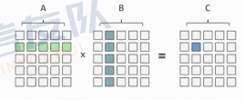
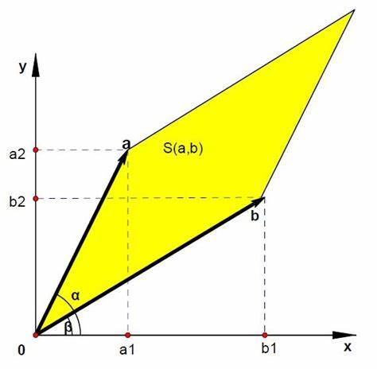
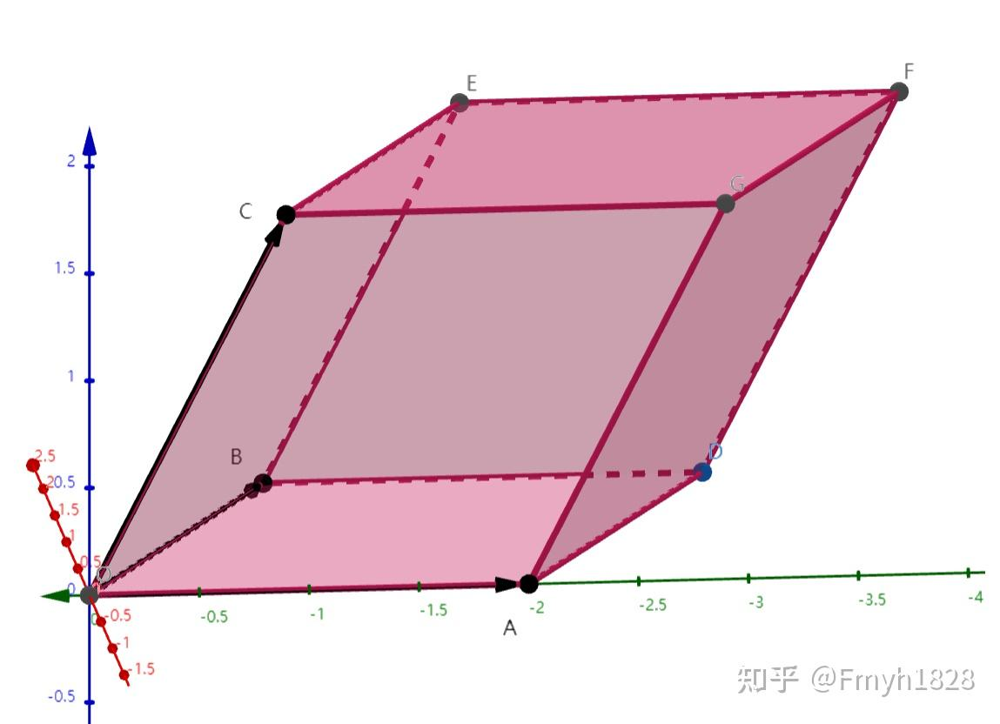

# 数学

待办：修改格式

- [数学](#数学)
  - [初等数论](#初等数论)
    - [同余](#同余)
      - [同余的表示](#同余的表示)
      - [同余的性质](#同余的性质)
    - [费马小定理](#费马小定理)
    - [裴蜀定理](#裴蜀定理)
    - [逆元](#逆元)
      - [求解逆元](#求解逆元)
      - [线性求解逆元](#线性求解逆元)
    - [逆元例题](#逆元例题)
      - [B3717 组合数问题](#b3717-组合数问题)
        - [B3717题解](#b3717题解)
      - [P3403 跳楼机](#p3403-跳楼机)
        - [P3403题解](#p3403题解)
        - [P3403代码](#p3403代码)
    - [欧几里得算法](#欧几里得算法)
    - [扩展欧几里得](#扩展欧几里得)
      - [扩展欧几里得参考代码](#扩展欧几里得参考代码)
    - [欧几里得算法例题](#欧几里得算法例题)
      - [P1516 青蛙的约会](#p1516-青蛙的约会)
        - [P1516题解](#p1516题解)
      - [CF1010C Border](#cf1010c-border)
        - [CF1010C题解](#cf1010c题解)
        - [CF1010C代码](#cf1010c代码)
      - [CF1427E Xum](#cf1427e-xum)
        - [CF1427E题解](#cf1427e题解)
    - [中国剩余定理（CRT）](#中国剩余定理crt)
      - [CRT引入](#crt引入)
      - [CRT概念](#crt概念)
      - [CRT过程](#crt过程)
      - [CRT代码](#crt代码)
      - [扩展（EXCRT）：模数不互质](#扩展excrt模数不互质)
        - [EXCRT两个方程](#excrt两个方程)
        - [EXCRT多个方程](#excrt多个方程)
  - [离散与组合数学](#离散与组合数学)
    - [多重集合](#多重集合)
    - [组合数](#组合数)
      - [组合恒等式](#组合恒等式)
    - [二项式定理](#二项式定理)
    - [二项式反演](#二项式反演)
  - [线性代数](#线性代数)
    - [向量](#向量)
      - [向量的运算](#向量的运算)
    - [矩阵](#矩阵)
      - [矩阵的运算](#矩阵的运算)
      - [行列式](#行列式)
        - [$n$ 阶行列式](#n-阶行列式)
        - [行列式的意义](#行列式的意义)
    - [矩阵例题](#矩阵例题)
      - [P1962 斐波那契数列](#p1962-斐波那契数列)
        - [P1962矩阵解法](#p1962矩阵解法)
        - [P1962非矩阵解法](#p1962非矩阵解法)

## 初等数论

### 同余

#### 同余的表示

若 $a \bmod m = b \bmod m$，则我们称 $a, b$ 同余，记作 $a \equiv b \pmod m$。

注意：c++中，一个负数 mod 另一个数结果还是负数。如 $-11 \% 3 = -2$。而在数学中， $-11 \% 3 = 1$

若 $a \equiv b \bmod m$，则 $m | (a - b), a - b = km (k \in \mathbb{Z})$，其中 $\mathbb{Z}$ 表示整数集合

#### 同余的性质

- 自反性： $a \equiv a \pmod m$
- 对称性：若 $a \equiv b \pmod m$，则 $b \equiv a \pmod m$
- 传递性：若 $a \equiv b \pmod m, b \equiv c \pmod m$，则 $a \equiv c \pmod m$

类似等式，在同余式的两边同时进行相同的线性运算也不影响结果。

如：

$$
a \equiv b \pmod m, c \equiv d \pmod m
$$

$$
\Downarrow
$$

$$
a \pm c \equiv b \pm d \pmod m, a \times c \equiv b \times d \pmod m
$$

### 费马小定理

对于正整数 $a$ 和质数 $p$，若 $a$ 不能被 $p$ 整除，则 $a^{p - 1} \equiv 1 \pmod p$

费马小定理可以用于求解逆元，见[求解逆元](#求解逆元)

### 裴蜀定理

$a, b$ 为非零整数，设 $d = \gcd(a, b)$，则方程 $ax + by = m$ 有解当且仅当 $m$ 为 $d$ 的倍数。

要求解这个方程，可以使用[扩展欧几里德算法](#扩展欧几里得)

### 逆元

当 $ab \equiv 1 \pmod m$，则称在模 $m$ 意义下 $a, b$ 互为逆元。

可以将 $b$ 记作 $a^{-1}$

#### 求解逆元

求解模 $m$ 意义下的逆元，相当于求解 $ax \equiv 1 \pmod m$ 中的 $x$。

可以发现，当 $a$ 和 $m$ 互质时，原方程才有解，**即 $a$ 和 $m$ 互质时， $a$ 存在逆元**。

由于使用扩展欧几里得算法求解过于复杂，下面将会介绍一种更为简单地方法。

若 $\gcd(a, p) = 1$，则 $a^{p - 1} \equiv 1 \pmod p, p \in \mathbb P$，其中 $\mathbb P$ 表示质数集合。

根据这一定理，我们可以发现 $a \times a^{p - 2} \equiv 1 \pmod p$

所以，在模 $p$ 的意义下， $a$ 与 $a^{p - 2}$ 互为逆元。

故可以用快速幂来求解逆元，时间复杂度为 $O(\log m)$

需要注意的是，这种方法只适用于模数为质数的情况。非质数的情况需要用扩展欧几里得算法求解。

#### 线性求解逆元

费马小定理单次求解逆元的复杂度为 $O(\log n)$，若要求解 $[1, n)$ 中所有数的逆元，总的时间复杂度为 $O(n \log n)$

为了应对这种情况，还有一种 $O(n)$ 的递推方法，用于快速求解逆元。

首先，不难发现，对于任意的模数， $1$ 与本身都互为逆元。

接下来考虑递推。

假设已知 $[1, x)$ 中所有数的逆元，要求 $x$ 的逆元。

首先将 $n$ 表示为 $kx + t$

其中 $k=\lfloor \frac{n}{x} \rfloor, t = n \bmod x$

所以 $kx + t \equiv 0 \pmod n$

在两边同乘 $x^{-1} \times t^{-1}$ 后，可得 $kt^{-1} + x^{-1} \equiv 0 \pmod n$

移项后得到 $x^{-1} \equiv -kt^{-1} \pmod n$，即得到递推式 $x^{-1} \equiv -\lfloor \frac{n}{x} \rfloor (n \bmod x)^{-1} \pmod n$

而因为 $1 \le (n \bmod x) \le x$，则一定可以从已有的值推出 $x^{-1}$

### 逆元例题

#### B3717 组合数问题

[题目链接](https://www.luogu.com.cn/problem/B3717)

给定多组 $n, m$，求 $C^n_m \bmod 998244353$

##### B3717题解

首先展开：

$C^n_m=\frac{n!}{m! \times (n - m)!}$

因此为了快速求解，就需要求出所有数的阶乘及其逆元。

如果对于每个数的阶乘单独求逆元，肯定无法通过此题。

所以我们记 $fact_x = x!$ 表示 $x$ 的阶乘， $inv_x$ 表示 $x$ 的逆元。

首先预处理 $inv_n = fact_n^{p - 2}$ （快速幂）

然后可以递推求解： $inv_x = \frac{1}{x!} = (x + 1) \times inv_{x + 1}$

预处理复杂度为 $O(n)$，单次查询复杂度为 $O(1)$

#### P3403 跳楼机

[题目链接](https://www.luogu.com.cn/problem/P3403)

有一个高度为 $h$ 的大楼，每次可以往上跳 $x, y, z$ 层或回到第一层，请问一共有多少个楼层可以到达。

$1 \le h \le 2^{63} - 1, 1 \le x, y, z \le 10^5$

##### P3403题解

令 $x \le y \le z$

首先根据 $\bmod\ x$ 的余数将楼层分成 $x$ 类。

容易发现，如果同类楼层中某个楼层可以到达，则高于它的同类部分也可以到达。

因此可以求出每一类楼层最低可以到达的楼层，就可以算出这一类有几层可以到达。考虑如何计算每一类楼层的最低可到达（使用 $y, z$ 来凑）

设 $f_i$ 表示 $\bmod x = i$ 的楼层的最低可到达。

转移即为：

$$
f_{(a + y) \bmod x} = min(f_{(a + y) \bmod x}, f_a + y) \\
f_{(a + z) \bmod x} = min(f_{(a + z) \bmod x}, f_a + z) \\
$$

发现可以使用最短路来解决。

##### P3403代码

```cpp
#include <bits/stdc++.h>
#define int long long
using namespace std;
int h, f[100005], x, y, z;
priority_queue<pair<int, int>, vector<pair<int, int>>, greater<pair<int, int>>> q;
bool inn[100005];
signed main()
{
    scanf("%lld%lld%lld%lld", &h, &x, &y, &z);
    for (int i = 1; i <= 100002; ++i)
        f[i] = LONG_LONG_MAX;
    f[0] = 1;
    q.push({1, 0});
    while (!q.empty())
    {
        int now = q.top().second;
        q.pop();
        if (inn[now])
            continue;
        inn[now] = 1;
        int to = (now + y) % x;
        if (f[to] > f[now] + y)
        {
            f[to] = f[now] + y;
            q.push({f[to], to});
        }
        to = (now + z) % x;
        if (f[to] > f[now] + z)
        {
            f[to] = f[now] + z;
            q.push({f[to], to});
        }
    }
    int ans = 0;
    for (int i = 0; i < x; i++)
    {
        if (f[i] > h)
            continue;
        ans += (h - f[i]) / x + 1;
    }
    printf("%lld", ans);
    return 0;
}
```

### 欧几里得算法

其实就是辗转相除法。

```cpp
int gcd(int a, int b){ return !b ? a : gcd(b, a % b);}
```

### 扩展欧几里得

对于任意正整数 $a, b$，考虑一元二次方程 $ax + by = c$ 的整数解.

对于任意整数 $x$，存在 $y = \frac{c - ax}{b}$ 为唯一解，所以只需要考虑这个式子是否为整数，即是否存在 $x$ 使得

$$ax \equiv c \pmod b$$

考虑 $c = \gcd(a, b)$ 时如何找到一组解。

显然当 $a = 0$ 或 $b = 0$ 时可以直接找到解。（不是废话，等会递归时要用）

假设已知 $(a \bmod b)x + by = \gcd(a, b)$ 的一组解 $x', y'$ 则：

$$
(a \bmod b)x' + by' = \gcd(a, b)
$$

$$
ax + by = \gcd(a, b)
$$

取 $x = x'$，两式相减得到：

$$
(a - a \bmod b)x + b(y - y') = 0
$$

注意到 $a - a \bmod b = b \times \lfloor \frac{a}{b} \rfloor$，因此该方程有整数解：

$$
y = y' - \frac{(a - a \bmod b)x}{b} = y' -  \lfloor \frac{a}{b} \rfloor x
$$

然后递归求解即可（**看代码**）

易证 $|x| \le |b|, |y| \le |a|$

这样就求到了一组特解 $x_0, y_0$，考虑求令一组解 $x, y$

$$
\left\{
    \begin{aligned}
        ax_0 &+ by_0 &= c \\
        ax &+ by &= c \\
    \end{aligned}
\right.
$$

$$
\Downarrow
$$

$$
a(x - x_0) + b(y - y_0) = 0
$$

$$
\Downarrow
$$

$$
\left\{
    \begin{aligned}
        a(x &- x_0) &= k\ lcm(a, b) = k \frac{ab}{\gcd(a, b)} \\
        -b(y &- y_0) &= k\ lcm(a, b) = k \frac{ab}{\gcd(a, b)} \\
    \end{aligned}
\right.
$$

$$
\Downarrow
$$

$$
\left\{
    \begin{aligned}
        x &= k \frac{b}{\gcd(a, b)} + x_0 \\
        y &= -k \frac{a}{\gcd(a, b)} + y_0 \\
    \end{aligned}
\right.
$$

这样就找到了令一组解

#### 扩展欧几里得参考代码

```cpp
int exgcd(int a, int b, int &x, int &y)
{
    if (b == 0)
    {
        x = 1, y = 0;
        return a;
    }
    int g = exgcd(b, a % b, y, x);
    y -= a / b * x;
    return g;
}
```

### 欧几里得算法例题

#### P1516 青蛙的约会

[题目链接](https://www.luogu.com.cn/problem/P1516)

两只青蛙在网上相识了，它们聊得很开心，于是觉得很有必要见一面。它们很高兴地发现它们住在同一条纬度线上，于是它们约定各自朝西跳，直到碰面为止。可是它们出发之前忘记了一件很重要的事情，既没有问清楚对方的特征，也没有约定见面的具体位置。不过青蛙们都是很乐观的，它们觉得只要一直朝着某个方向跳下去，总能碰到对方的。但是除非这两只青蛙在同一时间跳到同一点上，不然是永远都不可能碰面的。为了帮助这两只乐观的青蛙，你被要求写一个程序来判断这两只青蛙是否能够碰面，会在什么时候碰面。

我们把这两只青蛙分别叫做青蛙 A 和青蛙 B，并且规定纬度线上东经 $0$ 度处为原点，由东往西为正方向，单位长度 $1$ 米，这样我们就得到了一条首尾相接的数轴。设青蛙 A 的出发点坐标是 $x$，青蛙 B 的出发点坐标是 $y$。青蛙 A 一次能跳 $m$ 米，青蛙 B 一次能跳 $n$ 米，两只青蛙跳一次所花费的时间相同。纬度线总长 $L$ 米。现在要你求出它们跳了几次以后才会碰面。

$1 \le x \ne y \le 2 \times 10^{9}, 1 \le m, n \le 2 \times 10^{9}, 1 \le L \le \text{INTMAX}$。

##### P1516题解

设 $k$ 时刻相遇。

$$
(m - n)k \equiv (y - x) \pmod l
$$

若 $y - x$ 不是 $\gcd(m - n, l)$ 的倍数，则无解。

否则，令

$$
g \leftarrow \gcd(y - x, l), b = \frac{y - x}{g}, a = \frac{m - n}{g}, l' = \frac{l}{g}
$$

要求的值即为 $ak \equiv b \pmod {l'}$ 的 $k$

由于 $\gcd(l', a) = 1$， $a$ 在 $\bmod {l'}$ 意义下[逆元](#逆元)存在，即 $k \equiv ba^{-1} \pmod {l'}$

所以只需要找出满足

$$
aa^{-1} - kl' = 1
$$

的 $a^{-1}, k$ 即可，且 $0 \le a^{-1} \lt l$

复杂度 $O(\log V)$， $V$ 为输入数据范围最大值

#### CF1010C Border

[题目链接](https://www.luogu.com.cn/problem/CF1010C)

给定 $n$ 个数 $\{a_i\}_{i = 1}^{n}$，求这些数的线性组合模 $k$ 有多少种不同的值。

##### CF1010C题解

根据[裴蜀定理](#裴蜀定理)：

$$
\sum_{i = 1}^{n}c_i a_i = c
$$

有解当且仅当 $c$ 是 $\gcd(a_1, \dots , a_n)$ 的倍数，也就是说原式的线性组合一定是 $\gcd(a_1, \dots , a_n)$ 的倍数。

这是二维[裴蜀定理](#裴蜀定理)（ $ax + by = c$ 有解，当且仅当 $c$ 是 $\gcd(a, b)$ 的倍数）的扩展

考虑将方程变形：

$$
\sum^{n}_{i = 1}c_i a_i \equiv c \pmod k \Rightarrow \sum^{n}_{i = 1} c_i a_i - c_{n + 1} a_{n + 1} = c
$$

$$
(0 \le c \le k, a_{n + 1} \leftarrow k)
$$

也就是说有解的 $c$ 一定是 $\gcd(a_1, \dots , a_n, k)$ 的倍数。依次输出即可。

时间复杂度 $O((n + k) \log k)$

##### CF1010C代码

```cpp
#include <bits/stdc++.h>
#define int long long
using namespace std;
int a[100005];
vector<int> q;
signed main()
{
    int n, k;
    int ans;
    scanf("%lld%lld", &n, &k);
    for (int i = 1; i <= n; ++i)
    {
        scanf("%lld", &a[i]);
        if (i == 1)
            ans = a[1];
        else
            ans = __gcd(ans, a[i]);
    }
    ans = __gcd(ans, k);
    int ns = 0;
    while (ans * ns < k)
    {
        q.push_back(ns * ans);
        ++ns;
    }
    printf("%d\n", q.size());
    for (int i : q)
        printf("%lld ", i);
    puts("");
    return 0;
}
```

#### CF1427E Xum

[题目链接](https://www.luogu.com.cn/problem/CF1427E)

给定一个集合 $\{x\}$， $x$ 是奇数，你可以对这个集合进行如下操作：

- 选取集合里的两个数 $x, y$，插入 $x + y$
- 选取集合里的两个数 $x, y$，插入 $x \oplus y$

构造一个操作方式，使得序列内出现 $1$

##### CF1427E题解

[构造](../1.基础算法/基础算法.md#构造转换模拟)题。

考虑构造 $x, y$ 使得 $\gcd(x, y) = 1$ 即可使用[扩展欧几里得算法](#扩展欧几里得)构造出 $1$。

经过打表构造发现当 $x$ 是奇数， $y$ 可以取 $x \oplus 2^{k - 1}x$，其中 $k$ 为 $x$ 二进制下的长度，此时便可构造出 $\gcd(x, y) = 1$

### 中国剩余定理（CRT）

#### CRT引入

小学奥数问题：

> 有物不知其数，三三数之剩二，五五数之剩三，七七数之剩二。问物几何？

转换为同余式如下：

$$
\left\{
    \begin{aligned}
        x &\equiv 2 \pmod 3 \\
        x &\equiv 3 \pmod 5 \\
        x &\equiv 2 \pmod 7 \\
    \end{aligned}
\right.
$$

该问题最早见于《孙子算经》中，并有该问题的具体解法。宋朝数学家秦九韶于 1247 年《数书九章》卷一、二《大衍类》对「物不知数」问题做出了完整系统的解答。上面具体问题的解答口诀由明朝数学家程大位在《算法统宗》中给出：

> 三人同行七十希，五树梅花廿一支，七子团圆正半月，除百零五便得知。

$2 \times 70 + 3 \times 21 + 2 \times 15 = 233 = 2 \times 105 + 23$，故答案为 $23$。

#### CRT概念

中国剩余定理（Chinese Remainder Theorem, CRT）可以求解如下形式一元线性同余方程组（ $n_1, n_2, \dots, n_k$ 两两互质）：

$$
\left\{
    \begin{aligned}
        x &\equiv a_1 \pmod{n_1} \\
        x &\equiv a_2 \pmod{n_2} \\
        &\dots \\
        x &\equiv a_k \pmod{n_k} \\
    \end{aligned}
\right.
$$

#### CRT过程

1. 计算所有模数的乘积 $n$
2. 对于每一个方程：
   1. 计算 $m = \frac{n}{n_i}$
   2. 计算在 $\pmod n_i$ 意义下的 $m_i^{-1}$
   3. 计算 $c_i = m_i m_i^{-1}$
3. 方程组在 $\pmod n$ 意义下的唯一解为 $x = \sum^{k}_{i = 1} a_i c_i \pmod n$

#### CRT代码

```cpp
LL CRT(int k, LL *a, LL *r)
{
    LL n = 1, ans = 0;
    for (int i = 1; i <= k; i++)
        n = n * r[i];
    for (int i = 1; i <= k; i++)
    {
        LL m = n / r[i], b, y;
        exgcd(m, r[i], b, y); // b * m mod r[i] = 1
        ans = (ans + a[i] * m * b % n) % n;
    }
    return (ans % n + n) % n;
}
```

#### 扩展（EXCRT）：模数不互质

##### EXCRT两个方程

已知两个方程：

$$
x \equiv a_1 \pmod{m_1} \\
x \equiv a_2 \pmod {m_2} \\
$$

将其转换为不定方程：

$$
x = m_1p + a_1 = m_2q + a_2
$$

其中 $p, q$ 为整数，则

$$
m_1p - m_2q = a_2 - a_1
$$

根据[裴蜀定理](#裴蜀定理)，当 $a_2 - a_1$ 不能被 $\gcd(a, b)$ 整除，无解。

否则可以用[扩展欧几里得算法](#扩展欧几里得)解出一组可行解。

##### EXCRT多个方程

两两合并即可。

---

## 离散与组合数学

### 多重集合

多重集合是集合概念的推广，不满足集合的互异性，因此**多重集合不是集合**。多重集合有两种表示方法： $\{a_1, \dots, a_1, a_2, \dots, a_2, \dots\}, \{n_1 \times a_1, n_2 \times a_2, \dots\}$。当 $n_i = \infty$ 时表示有无穷个 $a_i$。

### 组合数

从 $n$ 个物品选 $m$ 个的方案数

$$
{n \choose m} = \frac{n!}{m!\ (n - m)!}
$$

#### 组合恒等式

$$
{n \choose m} = {n \choose {n - m}} = {\frac {n}{m}}{{n - 1} \choose {m - 1}} = {{n - 1} \choose m} + {{n - 1} \choose {m - 1}}
$$

$$
\sum^m_{i = 0}{n \choose i} = {{m + 1} \choose {n + 1}}
$$

$$
\sum^k_{i = 0}{n \choose i}{m \choose {k - i}} = {{n + m} \choose k}
$$

### 二项式定理

$$
(x + y)^n = \sum^n_{k = 0}{n \choose k}x^{k}y^{n - k}
$$

其实就是展开式的通项公式。

### 二项式反演

若已知函数 $g$：

$$g_n = \sum^{n}_{i = 0} {n \choose i}f_i$$

则：

$$f_n = \sum^{n}_{i = 0}(-1)^{n - i}{n \choose i}g_i$$

证明就算了吧。。。

---

## 线性代数

### 向量

向量一般是用于表示一个点或者一个点到另外一个点的偏移量。用于表示一个点时，这个向量就代表原点到这个点的偏移量。一个向量可以表示为 $(a_1, a_2, \dots)$ 或者 $\left(\begin{aligned}a_1 \\ a_2 \\ \dots\end{aligned}\right)$。向量可分为行向量和列向量。

#### 向量的运算

设 $u = (u_1, u_2 \dots), v = (v_1, v_2, \dots)$

- $u \plusmn v = (u_1 \plusmn v_1, u_2 \plusmn v_2, \dots)$
- $su = (s \cdot u_1, s \cdot u_2, \dots)$
- $u \cdot v = u_1 \cdot v_1 + u_2 \cdot v_2 + \dots = ||u||\ ||v|| \cos \theta$
- $u \times v = u_1 \cdot v_2 - u_2 \cdot v_1$
- $||u|| = \sqrt{u \cdot u} = \sqrt{u_1^2 + u_2^2 + \dots}$

### 矩阵

矩阵 (Matrix) 是一个按照长方阵列排列的复数或实数集合，最早来自于方程组的系数以及常数所构成的方阵。

由 $m \times n$ 个数 $a_{i, j}$ 排成的 $m$ 行 $n$ 列的数表称为 $m$ 行 $n$ 列的矩阵，简称 $m \times n$ 矩阵。记作：

$$
A = \left[
    \begin{array}{}
        a_{1, 1} & a_{1, 2} & \dots  & a_{1, n} \\
        a_{2, 1} & a_{2, 2} & \dots  & a_{2, n} \\
        \dots       & \dots       & \dots  & \dots       \\
        a_{m, 1} & a_{m, 2} & \dots  & a_{m, n} \\
    \end{array}
\right]
$$

这 $m \times n$ 个数称作矩阵 $A$ 的元素，简称为**元**，数 $a_{i, j}$ 位于矩阵 $A$ 的 $(i, j)$ 元，以数 $a_{i, j}$ 为 $(i, j)$ 元的矩阵记作 $(a_{i, j})$ 或 $(a_{i, j})_{m \times n}$

#### 矩阵的运算

- 加减法：只有同型矩阵才支持加减法。对应元素相加减即可。显然满足交换律，结合律。
- 数乘：每个元素都乘这个数即可。显然满足交换律，结合律和分配律。
- 转置：矩阵转置即交换每个元素的行与列下标。矩阵 $A$ 的转置记作 $A^T$

$$
(A^T)^T = A \\
(aA)^T = a(A^T) \\
(AB)^T = A^TB^T \\
$$

- 乘法：不同于加减法，矩阵乘法的要求是第一个矩阵的列数等于另一个矩阵的行数。一个 $n \times r$ 的矩阵乘一个 $r \times m$ 的矩阵得到的是一个 $n \times m$ 的矩阵 设

$$C = AB$$

则

$$C_{i, j} = \sum^{r}_{k = 1}a_{i, k}b_{k, j}$$

也就是说， $C$ 的第 $i$ 行 $j$ 列是由 $A$ 的第 $i$ 行和 $B$ 的第 $j$ 列逐个相乘的和转换而来。



显然，矩阵乘法不满足交换律，但是满足结合律。

#### 行列式

一个 $n \times n$ 的方阵 $A$ 的行列式记作 $\det(A)$ 或 $|A|$，一个 $2 \times 2$ 矩阵的行列式可以表示如下：

$$
\det
\left(
    \begin{array}{}
        a & b \\
        c & d \\
    \end{array}
\right) = ad - bc
$$

##### $n$ 阶行列式

$$
\left|
    \begin{array}{}
        a_{1, 1} & a_{1, 2} & \dots  & a_{1, n}    \\
        a_{2, 1} & a_{2, 2} & \dots  & a_{2, n}    \\
        \dots       & \dots       & \dots  & \dots \\
        a_{n, 1} & a_{n, 2} & \dots  & a_{n, n}    \\
    \end{array}
\right| =
\sum_{j_1j_2\dots j_n} (i1)^{\gamma(j_1j_2\dots j_n)}a_{1, j_1}a_{2, j2}\dots a_{n, j_n}
$$

其中 $\sum_{j_1j_2\dots j_n}$ 表示对 $1 - n$ 的所有排列枚举求和， $\gamma(j_1j_2\dots j_n)$ 表示 $j_1j_2\dots j_n$ 的逆序对数。

##### 行列式的意义

行列式的集合意义就是行列式中的每一行，或者称作行向量，所构成的超平行多面体的有向面积或体积。



如图两个向量 $(a_1, a_2), (b_1, b_2)$ 此图的面积即可用

$$
\left[
    \begin{array}{}
        a_1 & a_2 \\
        b_1 & b_2 \\
    \end{array}
\right]
$$

来表示。



三维同理。

### 矩阵例题

#### P1962 斐波那契数列

[题目链接](https://www.luogu.com.cn/problem/P1962)

求斐波那契数列的第 $n$ 项 $\pmod{1e9 + 7}$

$n \le 10^{18}$

##### P1962矩阵解法

矩阵 $A = \left[\begin{array}{} F_n & F_{n - 1} \end{array} \right], base = \left[\begin{array}{} 1 & 1 \\ 1 & 0 \end{array} \right], A \times base = \left[\begin{array}{} F_n + F_{n - 1} & F_n \end{array} \right] = \left[\begin{array}{} F_{n + 1} & F_n \end{array} \right]$

所以答案就是 $\left[\begin{array}{} 1 & 1 \end{array} \right] \times base^{n - 2}$ 的第一行第一列，矩阵快速幂即可（同普通快速幂，但是要重载运算符）。

##### P1962非矩阵解法

利用斐波那契递推公式：

$$
F_{2n} = F_{n + 1}^2 - F_{n - 1}^2 = (2F_{n - 1} + F_n) \times F_n \\
F_{2n + 1} = F_{n + 1}^2 + F_n^2
$$

数学归纳法即可证明。

直接用这个方法，是会超时的。

观察发现若要计算 $F_{100}$，则需要计算 $F_{50}, F_{49}$，而这两个数的递推都是 $F_{24}, F_{25}$，所以可以用 map 暂时记忆化即可解决。

---
